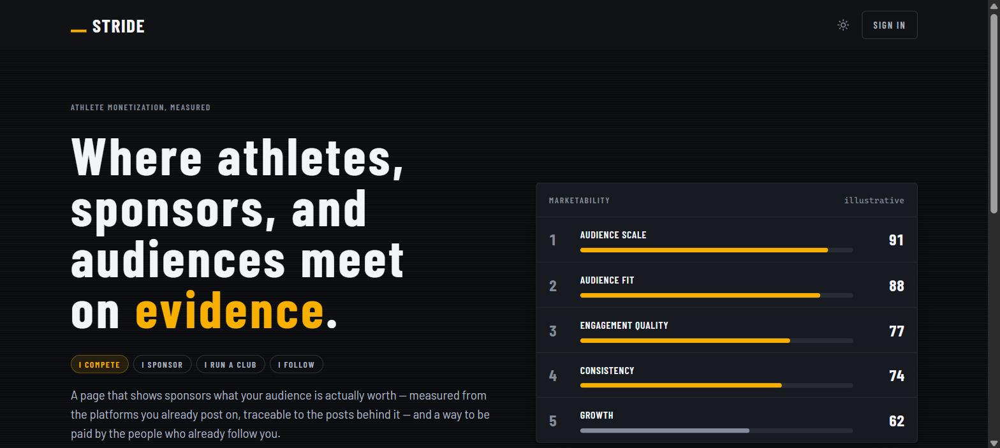
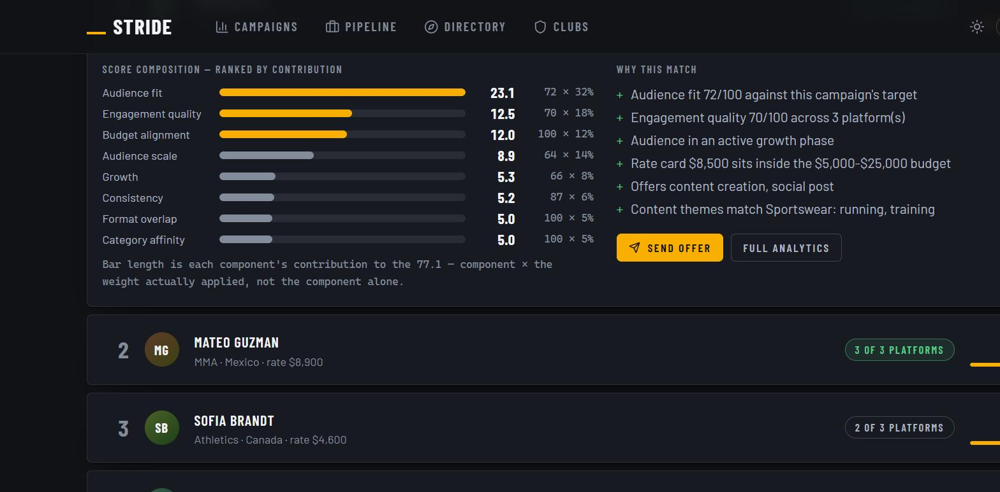
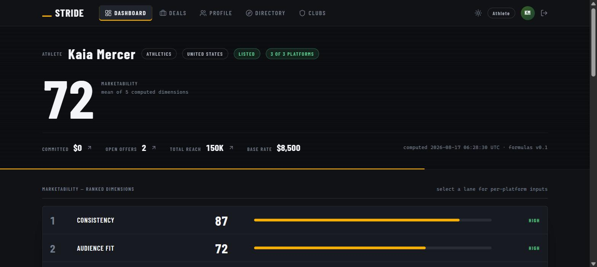
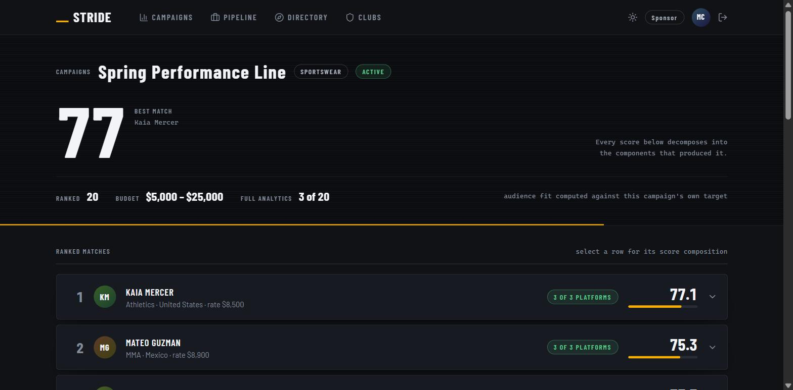
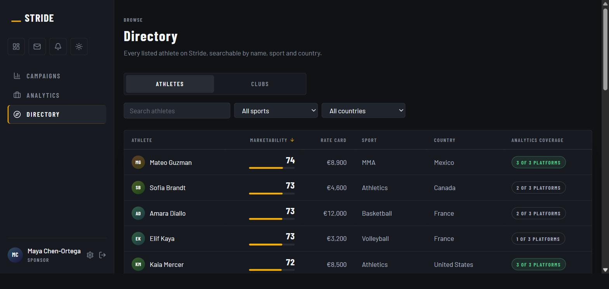
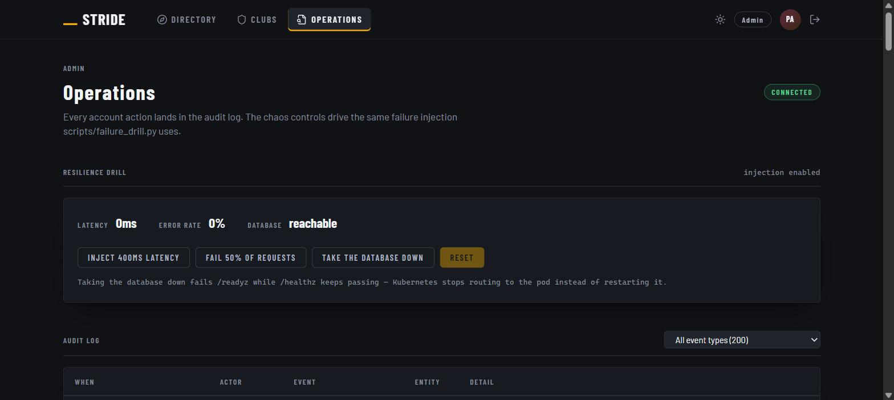

<p align="center">
  
</p>

<h1 align="center">Stride</h1>

<p align="center">
  <strong>The sponsorship marketplace where every number can be traced back to the post that produced it.</strong>
</p>

<p align="center">
  Athletes own evidence-based marketability analytics. Sponsors match campaign briefs against the
  athlete pool with fully decomposable scoring. Clubs sell packages. Fans follow.
</p>

<p align="center">
  
  
  
  
  
  
</p>

---

## The problem

Sponsorship is priced on assertion. An athlete says they have reach; a brand takes the number on
faith or pays an agency to guess. Nobody on either side of the table can decompose the price.

Stride replaces the assertion with a measurement that shows its working. Marketability is computed
from connected platforms through a **versioned formula set**, and every score carries the inputs,
the coverage, and the confidence behind it. A sponsor who disagrees with a score can open it and see
precisely which posts produced it.

**The commercial claim follows from the technical one:** a marketplace whose prices are explainable
is one where both sides can negotiate against evidence instead of reputation.

---

## Run it

Two terminals. The database seeds itself on first run.

```bash
# 1. API — uv manages Python                    http://127.0.0.1:8490
uv run stride serve

# 2. Web — from apps/web, first time: npm install    http://localhost:5173
npm run dev
```

Demo accounts, password `stride123`:

| Role | Email | Lands on |
|---|---|---|
| Athlete | `athlete@demo.stride` | Own analytics, platform connections, deal inbox |
| Sponsor | `sponsor@demo.stride` | Campaign briefs, ranked matching, deal pipeline |
| Club | `club@demo.stride` | Roster, sponsorship packages, commitments |
| Supporter | `fan@demo.stride` | Discovery and a following feed |
| Admin | `admin@demo.stride` | Audit log and resilience drill |

---

## What it looks like

### Matching that decomposes

Every match is a weighted sum a sponsor can take apart. Bar length is each component's **contribution**
to the score — component × the weight actually applied — so the chart ranks what really drove the
match, not which raw number happened to be largest.

<p align="center">
  
</p>

### The athlete's own board

The same numbers the sponsor sees. Information symmetry is deliberate: an athlete negotiating
against their own analytics is the point of the product.

<p align="center">
  
</p>

<details>
<summary><strong>More screens</strong> — ranked matching, directory, operations</summary>

<br>

**Ranked matches against a campaign brief**



**Public athlete directory, sortable on the measurement**



**Operations — audit log and resilience drill**



</details>

---

## How it works

```
apps/web/            React 18 · Vite · TS · Tailwind — 20 routes, each naming
                     its own access rule (public, or guarded by role)
apps/api/            FastAPI — auth + RBAC, routers per bounded context,
                     matching engine, JSON logs, /metrics, probes, chaos layer
packages/creatorlens/  the analytics engine, built first and vendored:
                     connectors → ingestion → KPIs → versioned scoring
infra/               Dockerfiles, compose, K8s manifests, Supabase migration + RLS
docs/                architecture · ui-architecture · product · costs · runbook
```

**The analytics core is a separate engine.** `packages/creatorlens` was built before the product
around it and is integrated, not reimplemented — connectors are mock today behind the production
interface, so going live changes one class per platform and nothing downstream.

**Five dimensions, each with its evidence:** audience scale, engagement quality, audience fit,
growth, consistency. A dimension the engine cannot compute stays `null` all the way through to the
ranking — it is excluded and named, never silently scored as zero.

**One code path, two databases.** SQLite by default; set `STRIDE_DATABASE_URL` for Postgres. A
~100-line shim translates the dialect, so nothing above the connection changes.

📐 Architecture: [`docs/architecture.md`](docs/architecture.md) · Client: [`docs/ui-architecture.md`](docs/ui-architecture.md) ·
Visual: open [`docs/system-map.html`](docs/system-map.html) and [`docs/how-it-works.html`](docs/how-it-works.html) in a browser

---

## The business

| | |
|---|---|
| **Revenue** | Take rate on sponsorship deals and club packages |
| **Unit economics** | On a $5,000 deal at 10%: ~$341 contribution after payment rails (~68% margin on fee revenue) |
| **Break-even** | At launch-stage infrastructure, **one mid-size deal a month covers the entire platform's operating cost** |
| **Cost per MAU** | $0.01 – $0.05 through 100k MAU — the architecture scales roughly linearly |
| **AI inference cost** | **$0.** Scoring and matching are deterministic formulas, not model calls |

Full staged cost model, per-transaction economics and the honest people-cost line:
[`docs/costs.md`](docs/costs.md). Product definition and role workflows:
[`docs/product.md`](docs/product.md). Phasing: [`docs/build-plan.md`](docs/build-plan.md).

---

## Privacy posture

This product asks athletes to connect social accounts, so the data position is part of the design
rather than an afterthought:

- **Consent is per platform, explicit, and recorded.** The connect endpoint refuses without it, and
  both the grant and any withdrawal land in the audit log with the policy version agreed to.
- **Aggregates only.** Stride receives age bands, gender splits and country shares. No row in the
  schema can identify an individual follower, because no such data is ever requested.
- **One cookie, and it is strictly necessary.** No analytics, no third-party scripts, no tracking —
  which is why there is no consent banner, a position the [Cookie Policy](apps/web/src/lib/legal.ts)
  explains rather than papers over.

---

## Verification

```bash
uv run pytest -q                       # 346 passed, 2 skipped (those two need Postgres)
cd apps/web && npx tsc -b && npx vite build
```

The suite covers role boundaries, matching decomposition, campaign-specific audience fit, the
consent trail, offer round-trips, and chaos injection with recovery.

Beyond the unit tests, the checks below run against a *running* server, because what they
assert is behaviour rather than code shape. Start the API first, then:

```bash
python scripts/journey.py     http://127.0.0.1:8490   # 38 product rules, end to end
python scripts/permissions.py http://127.0.0.1:8490   # 408 role x route combinations
python scripts/propagation.py http://127.0.0.1:8490   # 20 cross-role consequences
python scripts/links.py --api http://127.0.0.1:8490   # every link and API call resolves
python scripts/failure_drill.py                       # latency -> errors -> db down -> recovery
python scripts/admission_stress.py                    # the admission bar under a funnel sweep
```

And the business plan is held to its own model rather than to prose discipline:

```bash
python scripts/doc_consistency.py     # every figure in prose still matches model.py
python scripts/verify_workbook.py     # 1,973 formulas, no dangling refs, no cycles
python scripts/links.py --external    # every URL the plan cites is still reachable
```

`journey.py` and `permissions.py` write to the demo database and restore it afterwards, so
running them does not leave test applications sitting in the admin review queue.

---

## Containerized

```bash
docker compose -f infra/docker-compose.yml up --build   # web :8080, api :8490
kubectl apply -f infra/k8s/stride.yaml                  # probes, HPA, scrape annotations
```

---

<p align="center">
  <sub>First product draft — simulated athlete and sponsor data, by design, through the production pipeline.</sub>
</p>
