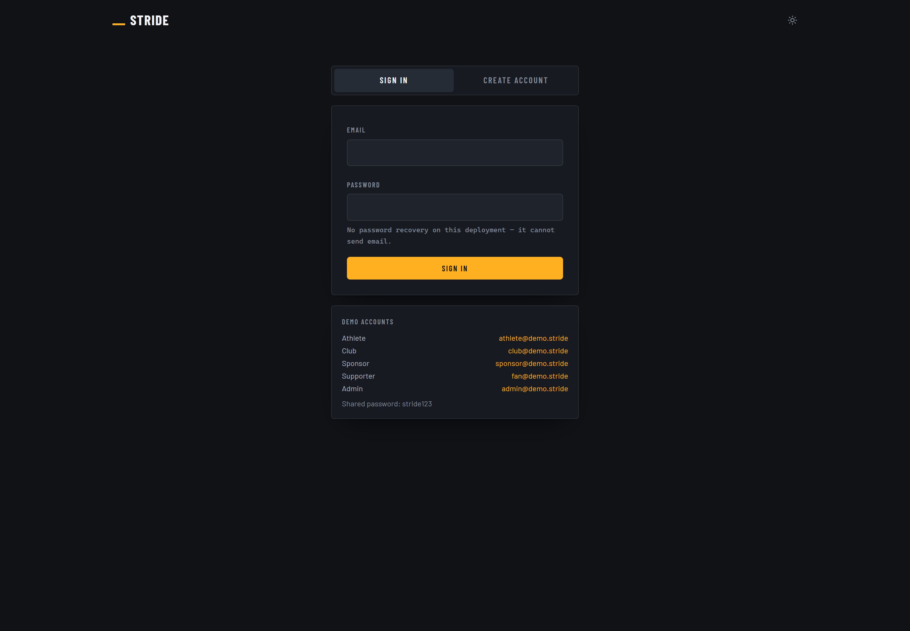
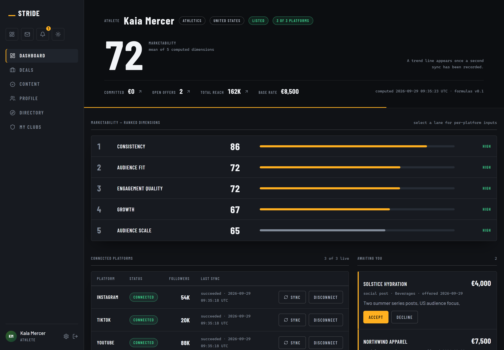
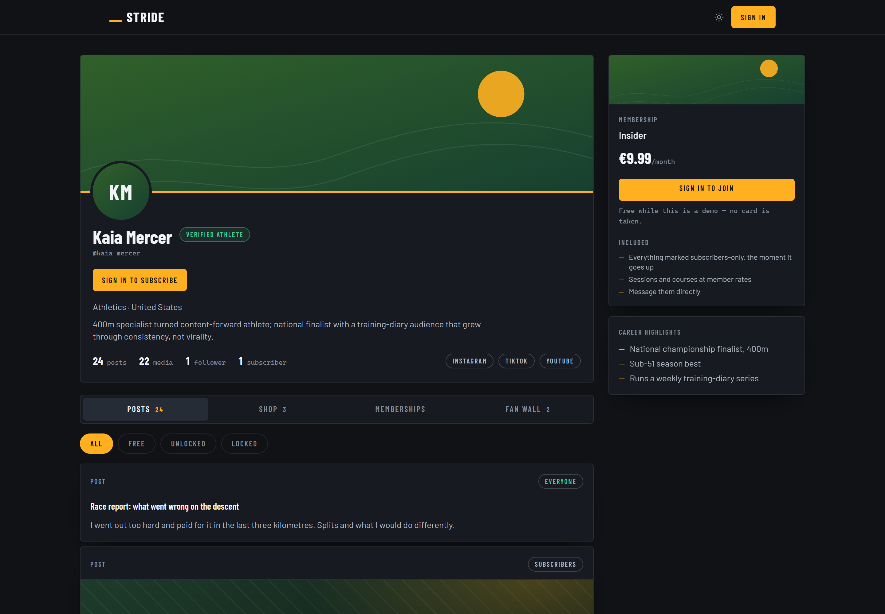
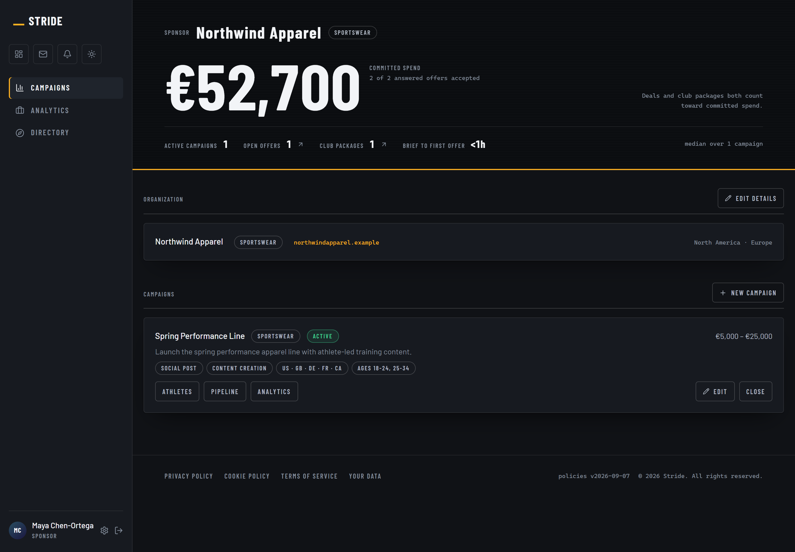
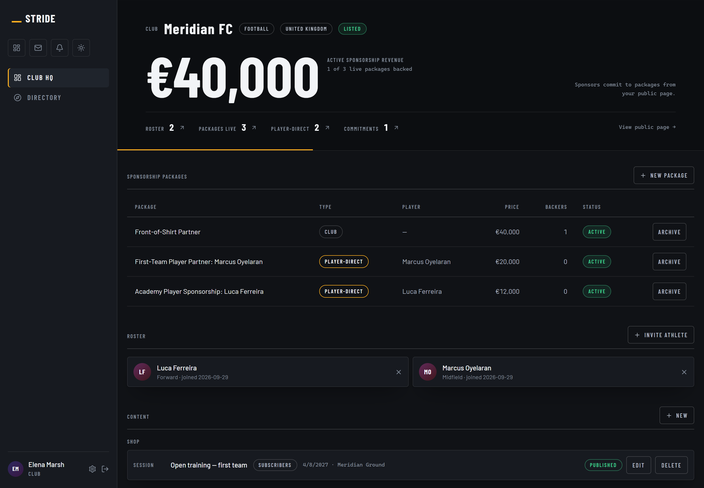
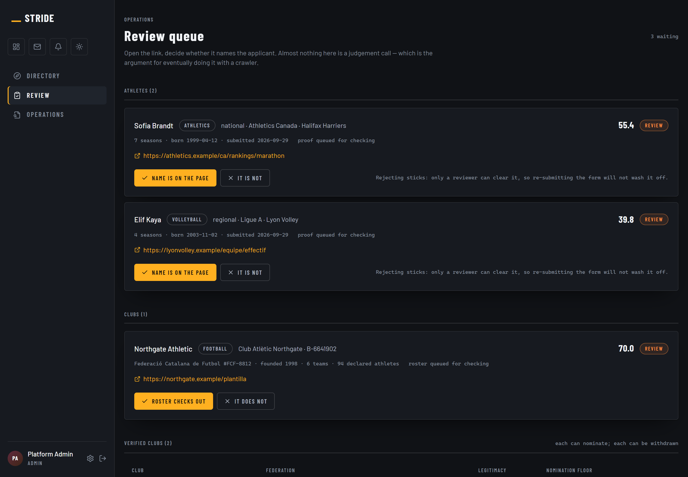

# 18: Product Walkthrough: The Deployed Demo

*Screens captured from the running application at [stride-demo.onrender.com](https://stride-demo.onrender.com), not mockups. The plan claims a working product exists; this is the evidence for that claim.*

---

## 18.1 What is actually built

The demo carries all four roles the marketplace needs, real authentication, and seeded data behind every figure on screen. The marketability score shown on the athlete dashboard is computed by the same scoring code described in Appendix K, not typed into a fixture.

Anyone may sign in with the accounts shown on the first screen. The container sleeps between visits, so the first page load takes about forty seconds.

---

## 18.2 Sign in

Five seeded roles, one per side of the marketplace, open to anyone. Route `/auth`, viewed signed out.

## 18.3 Athlete dashboard

The marketability score and its ranked dimensions, computed from connected platform data rather than self-reported. Route `/athlete`, viewed `athlete@demo.stride`.

## 18.4 Public athlete profile

The public profile, seen signed out. Identity, sport and club are open; the score and audience breakdown are withheld until a viewer is known. Route `/athletes/kaia-mercer`, viewed signed out.

## 18.5 Sponsor workspace

Campaigns carry a brief, and the brief is what the matching engine scores against. Route `/sponsor`, viewed `sponsor@demo.stride`.

## 18.6 Club HQ

The roster is the club channel of the sales plan: one relationship carries twenty to forty athletes. Route `/club`, viewed `club@demo.stride`.

## 18.7 Admission queue

The operations plan treats admission review as the only step consuming meaningful human time. This is that step. Route `/admin/review`, viewed `admin@demo.stride`.
