# 1. Executive summary

**Stride is a creator platform with a sponsorship feature.**

Athletes are creators with a second payer. OnlyFans proved that direct fan
monetisation beats ad-share; nobody has built it for athletes, who — unlike
lifestyle creators — also have sponsors, clubs, and a competitive record that
makes their audience measurable. Fan revenue leads and funds the early years.
Sponsorship compounds behind it, and the analytics engine earns its keep by
making the second payer possible, which a general creator platform cannot do.

**The wedge is the athletes nobody serves.** The segmentation that matters is
not *which sport* but **whether an intermediary already exists**. In popular
sports an agent takes 10 to 20% of an endorsement to make an introduction; in
niche sports there is no agent at all, and the athlete's alternative to Stride
is nothing. A trail runner with 25,000 followers has an inbox of unanswered
brand DMs and no idea what a fair rate is. Nobody is fighting us for her, and
what we learn there generalises upward. Football does not generalise downward.

**A working demo exists, not a slide deck.** Connected platform analytics,
versioned marketability scoring, an admission gate, campaign matching with
explainable ranking, offers, deals and delivery measurement — deployed, with an
audit log, a resilience drill, and a test suite that runs on two databases in
continuous integration.

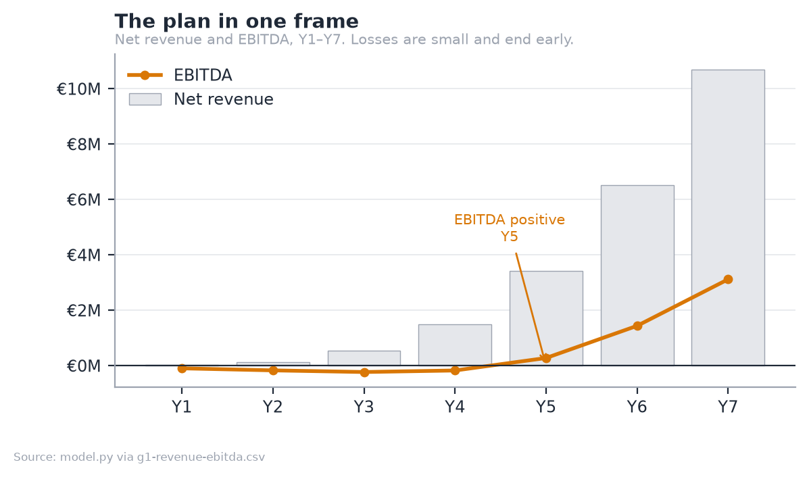

<!-- MODEL:summary -->
|  | Y3 | Y7 |
|---|---|---|
| Net revenue | €535k | €10.70M |
| EBITDA | €-228k | €3.12M |
| Active athletes | 3,000 | 22,000 |
| Paying fans | 25,288 | 321,288 |
| Gross margin | 64% | 70% |
<!-- /MODEL:summary -->

EBITDA turns positive in **Y5**. Take rates are published and fixed: **15% on
fan revenue, 10% on sponsorship**, with no monthly athlete fee. Gross margin
climbs from 64% in Y3 to **71% by Y10** rather than reaching a SaaS 80%+,
because the payment rail is real and no amount of engineering removes it.

**The ask is €600k at €2.5M pre-money.** The plan needs €649k — a €464k cash
trough in Y4 plus a 40% buffer — so the pre-seed clears the trough itself with
€136k to spare. That is what asking for €600k rather than €400k buys: the seed
becomes optional. It brings a second market forward; it is not the thing
standing between the company and running out of cash.

**One assumption carries the plan**: that niche-sport fans churn 45% slower than
the Patreon benchmark. Nothing in the product proves it and no further
engineering will. Three months of real subscription data from one anchor athlete
answers it, which is why that — not a feature — is the pre-seed gate.

---

# 2. The company

## 2.1 Business description

Stride is a two-sided marketplace, incorporated in Spain as a *Sociedad
Limitada*, connecting athletes in under-served sports with two sources of
income: **fans**, through paid subscriptions to training content and access, and
**sponsors**, through campaigns matched on measured audience evidence rather
than on an agent's contact list.

The company earns a take rate on both sides and a software subscription from
sponsors. It holds no inventory, employs no athletes, and does not represent
them. It is infrastructure, not an agency.

## 2.2 Mission, vision and objectives

**Mission.** To give every athlete with an audience a route to earn from it,
regardless of whether their sport has an industry around it.

**Vision.** That within ten years, a semi-professional athlete in a niche sport
in Europe treats income from their own audience as normal, in the way a
lifestyle creator does today.

**Objectives**, each measurable and each tied to a funding gate:

| Horizon | Objective | Measured by |
|---|---|---|
| Year 1 | Prove fans pay | 3 months of real subscription revenue from one anchor athlete |
| Year 1 | Supply density in one market | 400 active athletes in Spain |
| Year 3 | A functioning two-sided market | 3,000 athletes, 39 sponsors paying SaaS, €0.53M net revenue |
| Year 5 | Self-funding | EBITDA positive, without a Series A |
| Year 7 | Category position in Europe | 22,000 athletes across three or more markets, €10.70M net revenue |

## 2.3 The entrepreneurial team

**Jad Zoghaib — founder.** The venture sits at the intersection of three things
he has done: competitive sport, financial modelling of early-stage ventures, and
building data products.

- **Athlete.** Capped by the **Lebanese national rugby team**, with
  international tournament experience. He is not researching this market from
  the outside; he is in the segment the plan describes, and the athlete
  relationships that make the primary research in §3.1.4 possible are his own.
- **Four years in management consulting** across MENA — strategy at Alamiya
  Filmed Entertainment in Dubai, and consulting at Euromena and PFC-International
  in Beirut. The directly transferable work: feasibility studies for industrial
  ventures in the $5–15M range, DCF modelling with NPV, IRR and payback across
  scenarios, an OpEx reorganisation for a Saudi telecom that delivered SAR 650M
  of capital optimisation, and end-to-end process mapping of the filmmaking
  lifecycle as a process-mining initiative — the same discipline applied to the
  process map in §5.1.
- **MSc in Business Analytics, ESADE** (9.1/10), with a BSc in Economics from
  the Lebanese American University. Python, SQL, AWS and the modelling stack
  behind both the financial model and the product itself.
- **He built the product.** The deployed demo, the analytics engine and the
  financial model are his own work, which is why the plan can make claims about
  the technology that are checkable rather than aspirational.

**What the team lacks, stated plainly.** There is no co-founder, and the two
capabilities the plan most needs from outside are **sports-industry commercial
relationships** and **a senior engineer**. Both are the first hires (§6.2), and
the 2% advisory grant at the pre-seed is reserved for a sports-industry profile
rather than a technical one, because the code is not the weak point.

---

# 3. Opportunity and business model

## 3.1 Client and market

### 3.1.1 The client

Three customers, one of whom pays for two different things.

| Customer | What they want | What they pay |
|---|---|---|
| **The athlete** | Income from an audience they already have, without an agent | Nothing. They are the supply |
| **The fan** | Access, training content, proximity to an athlete they follow | €4.99–€14.99 a month |
| **The sponsor** | Athletes matched on evidence, and proof the campaign was delivered | 10% of deal value, plus SaaS |

The athlete is the constraint. Fans and sponsors follow supply, and supply in
this market is not scarce — it is unserved.

### 3.1.2 Market size

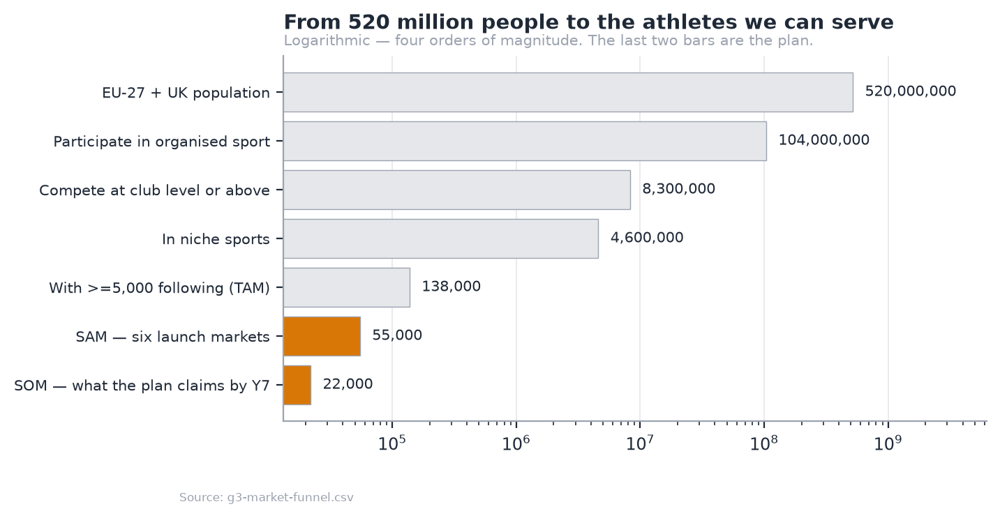

The funnel narrows from the EU-27 and UK population to a **TAM of 138,000
athletes** with 5,000 or more followers in niche sports, a **SAM of 55,000**
across six launch markets, and a Y7 target of **22,000** — 40% of the
serviceable market after seven years.

> [!note] The softest number in the plan, named as such
> The 3% step from "competes at club level" to "has 5,000 followers" is an
> estimate, not a measurement. It is the number most likely to be wrong, and the
> federation licence data in Appendix G is what would replace it.

### 3.1.3 Segmentation

The segmentation that decides strategy is **agent density**, not sport or
country.

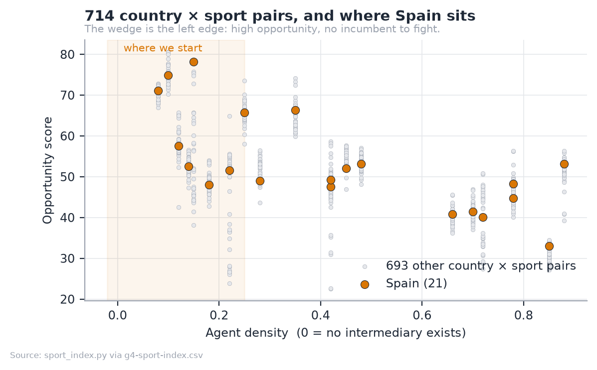

|  | Popular sports | Niche sports |
|---|---|---|
| Does an agent exist? | Yes, for the top. The tail is ignored | **No** |
| The athlete's alternative | An agent taking 10–20%, if one will take them | **Nothing** |
| What we sell | Disintermediation — 10%, matched on evidence | Market creation — monetise at all |
| Customer acquisition cost | Higher: an incumbent relationship to beat | Lower: no incumbent |

**We start where there is no incumbent.** The sport index scores 714 country ×
sport pairs on supply, demand, appetite and agent density; Spain in niche
endurance and combat sports is the opening position. Full method in Appendix H.

### 3.1.4 Market research

Two strands of primary research: an expert interview inside Olympic
broadcasting, and conversations with athletes in the target segment. Full
method, limitations and findings follow in **§3.1.5**.

**Expert — Íñigo Cristóbal Losada**, AI Lead at olympics.com after eleven years
at Olympic Broadcasting Services, where he was Broadcaster Services Manager
through Tokyo 2020 and Beijing 2022. He liked the idea, and gave three pieces of
advice. Two changed the plan.

> [!important] The research changed the product, which is the point of doing it
> The idea was originally pitched to him as a product *for the IOC*, open only
> to Olympic athletes. **He rejected that framing**: open registration to
> everyone, but build a filtering mechanism so that not anyone can register as
> an athlete.
>
> **The admission gate exists because of that conversation.** What was built as
> a result — and is live in the demo — is an application flow with automated
> proof-checking, a human review queue, versioned marketability scoring, and
> club nomination as a second route. Nothing self-verifies.

He also advised **phasing**: prioritise the content side, and roll the
sponsorship layer out as data accumulates. That independently matches the
revenue sequencing the model already had. And he pointed to the IOC's
**Athlete365** programme as a future partnership route; its Business
Accelerator serves elite athletes transitioning *out* of sport, which makes it
adjacent rather than competitive.

The full method, the athlete findings, the limitations and the research roadmap
follow in §3.1.5. In summary, the **athlete** conversations — rugby league
players in Lebanon and one competing at Asian level in CrossFit — produced four
findings:

1. **Current earnings are zero.** Not low. Nothing.
2. **The inequity is felt.** Influencers producing far less demanding content
   earn more than competing athletes do.
3. **Sponsorship arrives despite the sport, not because of it.** The one athlete
   who does have a sponsor did not get it as a rugby league player, because no
   route exists by which the sport itself produces the relationship.
4. **The suppression loop.** Athletes do not invest in building an audience
   because there is no return on doing so. *The absence of monetisation
   suppresses the supply of audience in the first place.*

That fourth finding matters for sizing: the TAM above counts athletes who
*already* have 5,000 followers, which measures the market under current
incentives. The plan does not claim the expansion, but the honest error
direction is understatement.

### 3.1.5 Primary research in full

<!-- INCLUDE: 15-market-research.md shift=2 renumber=3.1 -->

## 3.2 Value proposition

### 3.2.1 The need

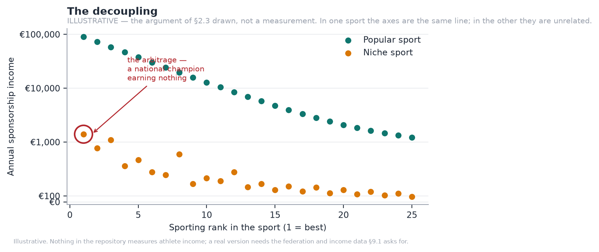

In a popular sport, sporting rank and sponsorship income are close to the same
line. In a niche sport they are unrelated: a national champion can earn nothing.
That gap is the opportunity, and it exists because the intermediation layer that
converts audience into income was never built for these sports.

**The general environment** works in the plan's favour on three fronts and
against it on one. Creator-economy infrastructure is mature and fans are
habituated to paying for access. EU regulation (DSA, DAC7, GDPR) raises the
compliance floor, which favours a platform built for it over an incumbent
retrofitting. Spain's *Ley de Startups* cuts corporate tax to 15% for the first
four taxable years. Against: consumer discretionary spending is under pressure,
and a subscription is discretionary.

### 3.2.2 The sector, and the competition

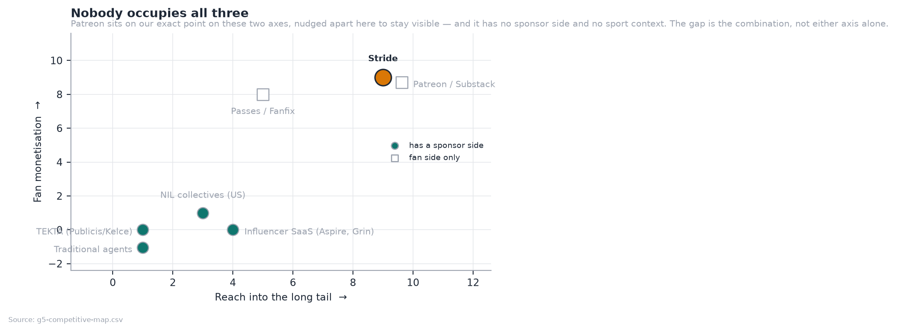

| Player | Fan monetisation | Long tail | Why they are not us |
|---|---|---|---|
| **TEKTA** (Publicis / Kelce) | None | Minimal | Human-mediated consultancy, gated to selected Publicis clients, US college NIL. Excludes the tail by design |
| Traditional agents | None | Minimal | 10–20% for introductions, only for athletes already worth representing |
| Patreon / Substack | Strong | Broad | No sponsorship side, no sport-specific measurement, no second payer |
| Sports data platforms | None | Broad | Sell data to clubs and media, not income to athletes |

**Suppliers** are few and consequential: Stripe for payments, AWS for compute, a
zero-egress CDN for media. Switching cost is low for all but Stripe, whose
pricing sets our unit economics (§5.10).

**Substitutes and new entrants.** The realistic substitute is the athlete doing
it themselves on Instagram and a bank transfer. A funded entrant is the real
risk (R4), and the defence is not the code — it is the accumulated scoring
history and the athlete relationships, which take time nobody can buy.

### 3.2.3 The offering

Athletes connect their platform accounts and apply. The engine scores
marketability on eight weighted components with the arithmetic visible. Admitted
athletes get a fan-facing page with paid tiers, and appear in the sponsor-facing
matching engine. Sponsors brief a campaign, receive a ranked and explained
shortlist, make offers, and get delivery measured automatically.

Three properties are worth a technical diligence call:

- **Every match score decomposes.** A ranked athlete shows all eight
  components, weighted, with the arithmetic visible: `audience fit 72 × 32% = 23.1`.
- **Missing data is `null`, never `0`.** An unmeasured campaign reads as
  unmeasured, not as free.
- **Nothing self-verifies.** A club above the verification bar still waits for a
  human. A rejected proof cannot be cleared by re-submitting the form.

## 3.3 Key success factors

**Positioning.** *The platform for athletes the industry ignores.* Not a
cheaper agent, not a sports Patreon: the first commercial infrastructure for
sports that never had any.

**Competitive advantage**, in the order it becomes durable:

1. **The data position.** Every admission decision and every campaign outcome
   improves the scoring model. This compounds and cannot be bought.
2. **Explainability as a sales asset.** Sponsors buy against evidence; a
   decomposable score shortens the sales cycle in a market that runs on
   assertion.
3. **The club channel.** One conversation brings a roster of 20–40 athletes with
   the verification problem already solved.
4. **Regulatory posture.** Consent, audit trail and aggregate-only audience data
   are built in, not retrofitted.

## 3.4 Costs and investment required

The product exists, which is what makes the launch cost small. Total capital
required is **€649k**: a €464k cash trough in Y4 plus a 40% buffer. Against
that, **€80k** of founder time and direct cost is already spent. The gap between
today and first revenue is one entity and one processor — there is no payment,
tier-price or payout entity of any kind, and the €9.99 on the membership card is
a label rendered by the client, not a price.

## 3.5 Revenue sources

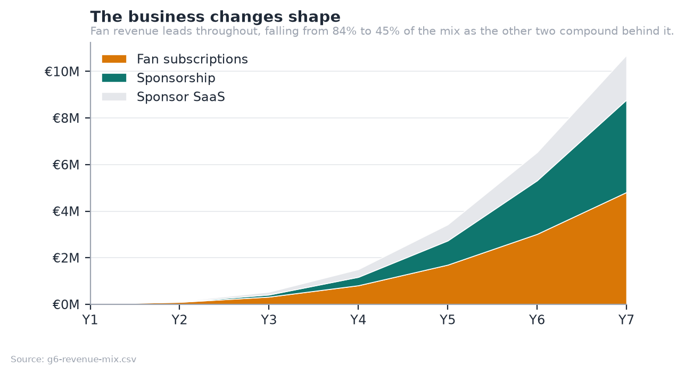

| Stream | Basis | Y7 |
|---|---|---|
| **Fan subscriptions** | 15% of fan GMV | €4.81M |
| **Sponsorship** | 10% of deal value | €3.97M |
| **Sponsor SaaS** | Monthly subscription, tiered | €1.92M |

Full derivation, tier design and the take-rate argument in **Appendix A**.

---

# 4. Marketing plan

## 4.1 Product strategy

Two products on one platform: the athlete's fan-facing page with paid tiers, and
the sponsor's matching and measurement console. The sequencing is deliberate and
matches the expert advice in §3.1.4: **fan monetisation ships first**, because
it is the revenue leader and the assumption that needs testing; the sponsorship
engine — already built — compounds behind it.

## 4.2 Pricing strategy

**15% of fan revenue, 10% of sponsorship, no monthly athlete fee.**

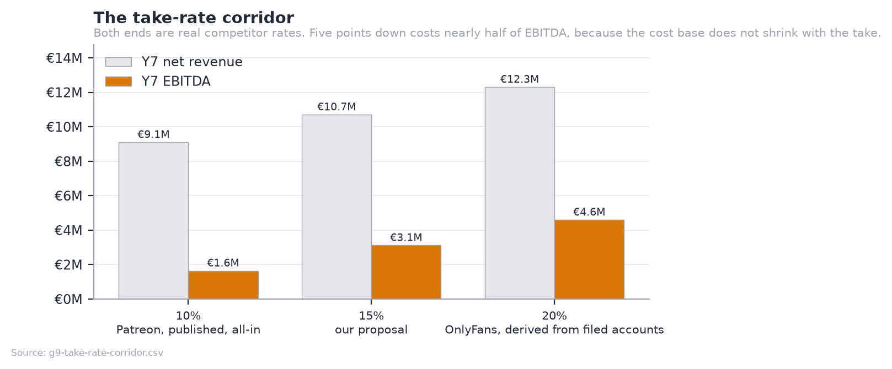

The corridor is bounded by published competitor economics: Patreon's all-in 10%
and OnlyFans' 20%, derived from filed accounts. At 15% we sit between them and
undercut the nearest comparable for any athlete earning under €1,380 a month,
which is the whole long tail.

> [!important] What the pricing decision costs, stated rather than hidden
> **15% flat with no athlete fee forfeits €1.6M of Y7 revenue** against a 20%
> take. It buys a pricing argument that survives contact with the exact athlete
> we target, and a flat rate means the athlete earning €200 a month pays the
> same rate as the one earning €5,000. A subscription fee would have been
> regressive.

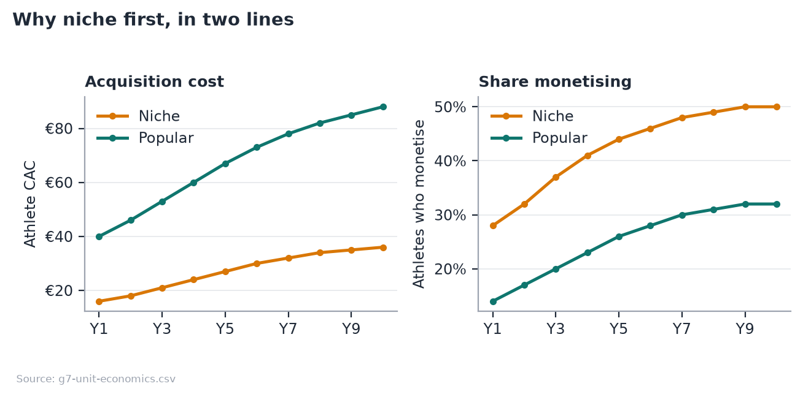

Niche athletes cost less to acquire and a larger share of them monetise. That
is the whole reason the plan starts there rather than in football, and it is
why the blended acquisition cost rises over the plan rather than falling: the
mix shifts toward popular sports as the company earns the right to compete for
them.

## 4.3 Communication strategy

**Athlete-side.** Community-led and sport by sport, not broadcast. The unit of
acquisition is a sport in a country, entered through people already in it. Cost
per athlete is modelled at €16–36 in niche sports and €40–88 in popular ones.

**Fan-side.** We do not acquire fans. Athletes bring their own audiences, which
is why the model carries no fan acquisition cost — disclosed in Appendix G as
understating the risk rather than presented as efficiency.

**Sponsor-side.** Outbound and evidence-led: the pitch is a shortlist with the
arithmetic shown, not a media pack.

## 4.4 Channel strategy

| Channel | Role | From |
|---|---|---|
| Direct athlete acquisition | The base, community-led | Y1 |
| **Club partnerships** | The compounding one: a roster, not an athlete | Y2 |
| Federation relationships | Credibility and licence data at national scale | Y3 |
| Sponsor self-serve | Lowers the cost of the long-tail sponsor | Y4 |
| Managed services | Higher take, higher touch, largest campaigns | Y6 |

## 4.5 Sales forecast

| | Y1 | Y3 | Y5 | Y7 | Y10 |
|---|---|---|---|---|---|
| Active athletes (year end) | 400 | 3,000 | 10,500 | 22,000 | 40,000 |
| Paying fans (year end) | 2k | 25k | 120k | 321k | 666k |
| Sponsors on the platform | 25 | 230 | 900 | 2,000 | 3,600 |
| of which paying SaaS | 1 | 39 | 180 | 400 | 720 |
| **Net revenue** | **€0.02M** | **€0.53M** | **€3.43M** | **€10.70M** | **€25.38M** |

---

# 5. Operations plan

<!-- INCLUDE: 12-operations-plan.md shift=1 renumber=5 -->

# 6. Organization and human resources

<!-- INCLUDE: 13-organization-and-hr.md shift=1 renumber=6 -->

# 7. Financial plan

*Condensed. The seven-year model, scenarios and full statements are in
**Appendix C**; capital and valuation in **Appendix D**.*

## 7.1 Assumptions

Every figure in this plan is generated by a Python model and cross-checked
against an Excel workbook that reproduces it independently. **A consistency
guard checks 277 prose claims across 14 documents** against the model and fails
the build if any figure drifts; a second guard evaluates all 2,520 workbook
formulas and requires every variance against the Python model to be zero.

The assumptions that matter most:

| Assumption | Value | Confidence |
|---|---|---|
| Fan monthly churn, niche | 9% (45% slower than Patreon benchmark) | **Low — this is R1** |
| Fans per monetising athlete | 20 → 41 over ten years | Low |
| Athletes who monetise | 28% → 55% (niche) | Medium |
| Fan ARPU | €8.00 → €9.50/month, VAT inclusive | Medium |
| Take rate, fan / sponsorship | 15% / 10% | Set by us |
| Payment processing | 1.9% + €0.25 | High — published |
| VAT on fan subscriptions | 21% blended | Medium |
| WACC | 25% | Standard for stage |

## 7.2 Profit and loss

| €k | Y1 | Y2 | Y3 | Y4 | Y5 | Y6 | Y7 |
|---|---|---|---|---|---|---|---|
| Net revenue | 25 | 134 | 535 | 1,504 | 3,426 | 6,527 | 10,702 |
| Cost of sales | 13 | 57 | 191 | 503 | 1,098 | 2,008 | 3,213 |
| **Gross profit** | **11** | **77** | **344** | **1,001** | **2,328** | **4,519** | **7,489** |
| Operating costs | 106 | 247 | 572 | 1,174 | 2,049 | 3,080 | 4,370 |
| **EBITDA** | **−95** | **−169** | **−228** | **−173** | **278** | **1,439** | **3,119** |

Growth decelerates from +442% in Y2 to +64% in Y7, which is the shape a
marketplace should have. Gross margin climbs from 64% in Y3 to 71% by Y10.

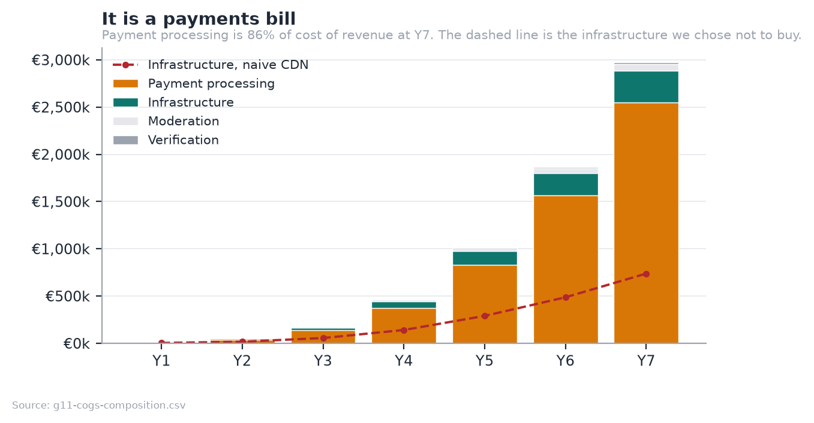

**Payment processing is 24% of Y7 revenue and nearly eight times infrastructure.**
Any optimisation effort belongs in tier pricing, annual billing and processor
negotiation, not in the AWS bill.

## 7.3 Pro forma balance sheet

| €, year end | Y1 | Y3 | Y5 | Y7 |
|---|---|---|---|---|
| Cash | €504k | €161k | €2.73M | €15.93M |
| Sponsor receivables | €0k | €26k | €213k | €726k |
| Net intangible assets | €11k | €52k | €170k | €410k |
| **Total Assets** | **€516k** | **€239k** | **€3.12M** | **€17.06M** |
| Athlete payout float | €8k | €144k | €989k | €3.23M |
| Trade payables | €9k | €47k | €168k | €359k |
| **Total Liabilities** | **€17k** | **€191k** | **€1.16M** | **€3.59M** |
| Paid-in capital | €600k | €600k | €2.60M | €10.60M |
| Retained earnings | €-101k | €-552k | €-642k | €2.88M |
| **Total Equity** | **€499k** | **€48k** | **€1.96M** | **€13.48M** |
| **BALANCE CHECK** | **0** | **0** | **0** | **0** |

The balance sheet is generated by the workbook and carries its own arithmetic
check: the **balance check row is zero in every year**, which the verification
script re-computes from the formulas rather than reading a cached value.

Two lines are worth a comment. **Net intangible assets** are capitalised
development — 30% of people cost, amortised over three years — which is the
honest treatment for a software business whose productive asset is its codebase
rather than equipment. The **athlete payout float** is money collected from fans
and not yet settled to athletes; it is a working-capital benefit and a trust
obligation at the same time, and it is disclosed as both rather than quietly
counted as cash.

## 7.4 Pro forma cash flow

| €, indirect method | Y1 | Y3 | Y5 | Y7 |
|---|---|---|---|---|
| Net profit | −€101k | −€265k | €153k | €2.38M |
| Add back amortisation | €6k | €37k | €125k | €322k |
| Change in working capital | €16k | €110k | €516k | €1.09M |
| **Operating Cash Flow** | **−€79k** | **−€118k** | **€794k** | **€3.79M** |
| Capital expenditure | −€17k | −€63k | −€198k | −€462k |
| **Free Cash Flow** | **−€96k** | **−€181k** | **€596k** | **€3.33M** |
| Equity raised | €600k | 0 | 0 | 0 |
| **Closing Cash** | **€504k** | **€161k** | **€2.73M** | **€15.93M** |

Free cash flow turns positive in **Y5**, one year after the trough. The working
capital line is a source of cash rather than a use of it, which is unusual and
worth explaining: sponsors settle at 45 days while fans pay upfront, and the
15-day athlete payout float means money is collected before it is disbursed.
That float is a trust obligation as well as a funding benefit, and section 5.7
treats it as both.

## 7.5 Cash position and financing

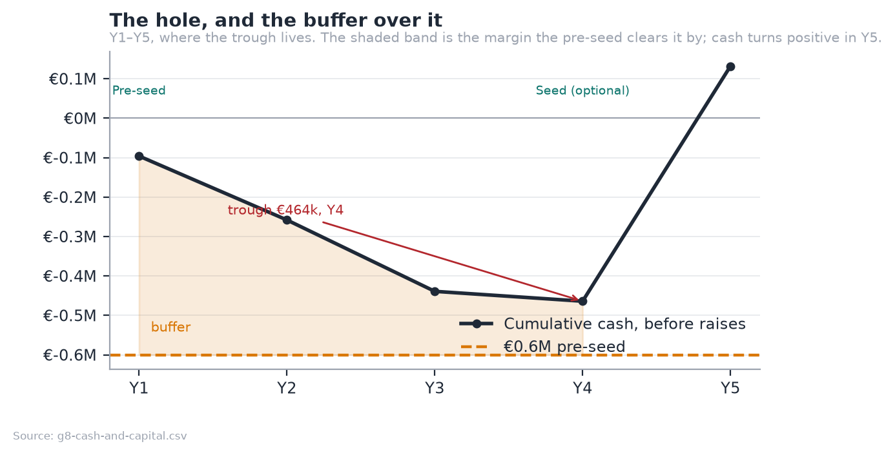

The deepest the cash ever goes is **€464k, in Y4**. A **€600k pre-seed covers
that with €136k to spare**, and free cash flow turns positive in Y5.

| Stage | Amount | Pre-money | Gate |
|---|---|---|---|
| Internal | €80k + time | — | Product exists ✓ |
| **Pre-seed** | **€600k** | **€2.5M** | 400 athletes · €10k MRR · anchor athlete public · payments live · **3 months fan churn** |
| Seed *(optional)* | €2.0M | €10M | €80k MRR · churn <8%/mo · CAC payback <9mo · 2nd market |
| Series A | €8.0M | €40M | €300k MRR · NRR >110% · sponsorship >25% of revenue |

> [!important] The seed is a growth option, not a survival requirement
> Because the pre-seed clears the trough, the honest answer to *"what happens if
> the next round does not come?"* is **"we grow more slowly"**, not "we die".
> That is a materially stronger position to raise from.

**Non-dilutive capital first.** A realistic ENISA and CDTI Neotec stack of
€300–500k covers most of the €464k trough on its own. The *Ley de Startups* 15%
rate is already in the model and is worth €1.57M across Y6–Y9.

**Dilution.** The founder holds 79% after the pre-seed and 2% advisory grant,
66% after the seed, 55% after the Series A, and **~49%** after the 10% ESOP.

## 7.6 Break-even and sensitivity

**Break-even is Y5 on EBITDA** and Y5 on free cash flow. The single most
sensitive input is fan churn.

| Scenario | Change vs base | Y7 revenue | Y7 EBITDA | Capital need |
|---|---|---|---|---|
| **Conservative** | Fans/athlete −30%, monetise rate −25% | ~€8.4M | ~€1.9M | ~€1.26M |
| **Base** | As modelled | €10.70M | €3.12M | €649k |
| **Growth-optimised** | Hire 12mo ahead, 3 markets from Y2 | ~€39M | ~€9M | €3–5M |

> [!danger] The model understates its own central risk, by construction
> The plan assumes niche fans churn 45% slower than benchmark. **At benchmark
> churn, holding the same Y10 fan base needs 0.79M gross adds a year instead of
> 0.64M** — a quarter more acquisition, every year, forever. Because the model
> charges nothing for fan acquisition, that burden does not appear as a cost.
> Being wrong about churn changes how hard the plan is to hold, not the
> destination, and that is a weaker claim than it first appears.

## 7.7 Valuation

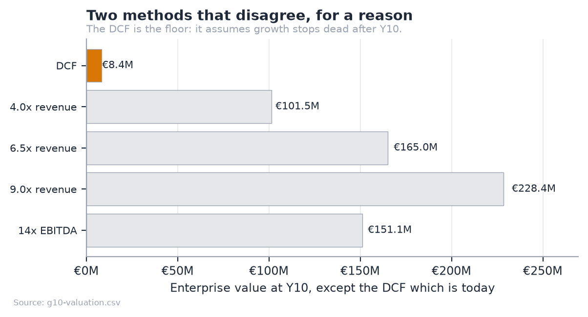

The DCF says **€8.37M** today; the blended exit multiple says €165.0M at Y10.
This is not an error in either — it is the standard failure of a
perpetuity-growth DCF applied to a company that has not finished growing. The
terminal value assumes growth collapses to 3% the day after Y10, from a year
that still grew 27%.

**Defensible headline: €11–25M enterprise value**, the Y10 exit multiples
discounted back at the same 25% WACC, with an **€8.37M floor** under a
no-growth-after-Y10 assumption.

---

# 8. Legal aspects and intellectual property

<!-- INCLUDE: 14-legal-and-growth.md shift=1 renumber=8 -->

# 9. Critical risks and contingency plans

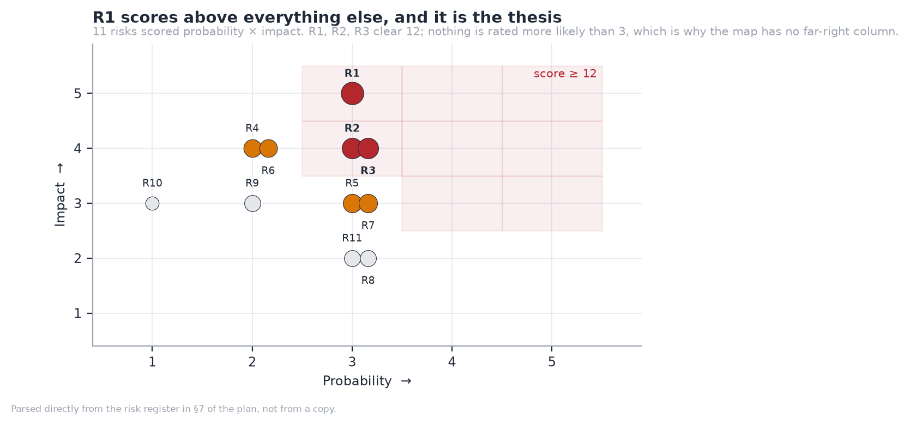

Eleven risks scored probability × impact, both 1–5. Three clear a score of 12,
and **nothing is rated more likely than 3**.

| # | Risk | Score | Contingency |
|---|---|---|---|
| **R1** | **Fans do not pay for niche athletes — the thesis fails** | **15** | P1 is built specifically to test this for €80k, not €2.6M. If false, the sponsorship marketplace remains a smaller, viable business |
| **R2** | Churn is at benchmark, not 45% better | 12 | Measure early, on one athlete, before the seed. The model understates this |
| **R3** | Athlete acquisition slower than modelled | 12 | Club and federation channels are multiplicative: one conversation is 20–40 athletes |
| R5 | Regulatory: DAC7, age assurance, startup law changes | 9 | Compliance built in; DAC7 reporting is a data export, not a rebuild |
| R7 | Moderation and content liability | 9 | Human review queue exists; prohibit adult content in the terms from day one |
| R4 | A funded competitor enters the niche | 8 | Data and liquidity are the moat, not the code |
| R6 | Payment costs rise or Stripe terms change | 8 | Multi-PSP architecture from P0; the take rate has corridor headroom |

**One risk sits above all the others and it is the thesis itself.** A risk map
that is evenly scattered has not identified which risk is the real one. Full
register, with mitigations, in Appendix G.

---

# 10. Growth and business development strategy

The growth strategy is set out in full at **§8.3** above, where it sits directly
beneath the corporate and intellectual property decisions that constrain it.
In summary, growth moves along three axes and only one moves at a time:
**market** (Spain through the pre-seed gate, a second market chosen for
sport-mix similarity rather than size, EU-wide from the Series A);
**product** (fan monetisation deepens before sponsorship widens); and
**channel** (the club channel is the growth strategy rather than a channel
within it, because one club conversation brings a roster of 20 to 40 athletes
with the verification problem already solved).

# 11. Conclusions

**The opportunity is real and it is structural.** In sports without an agent
layer, there is no route from having an audience to earning from it. That is not
a pricing failure to be competed away; it is missing infrastructure, confirmed
by athletes who earn nothing from audiences they already have and by an expert
with a decade inside Olympic broadcasting.

**The plan is modest by design, and that is its strength.** €600k of pre-seed
capital funds a company to profitability in Year 5. The pre-seed clears the
worst point in the cash curve on its own, which makes every subsequent round a
growth option rather than a rescue. A plan whose survival does not depend on the
next round arriving on schedule is a materially stronger one to raise against.

**The product is not the risk.** It is built, deployed and demonstrable, and
every figure in this document is generated by a model that is checked against an
independent implementation. The risk is a single assumption — that fans of
semi-professional athletes will pay — and the plan is deliberately arranged so
that assumption is tested for €80k and one year rather than €2.6M and four.

**What would change my mind.** If three months of subscription data from an
anchor athlete shows fans do not pay, the fan thesis is dead and what remains is
a smaller sponsorship marketplace: viable, but a different and less interesting
company. That test is the pre-seed gate, and it is a gate precisely because no
amount of further engineering, market sizing or interviewing can substitute for
it.

The honest summary is that this is a plan with one large uncertainty, arranged
so that the uncertainty is cheap to resolve and everything else is already done.

---

# 12. Bibliography

**Market and industry**

- Patreon. *Creator retention and annual billing benchmarks.* Published creator
  documentation and blog.
- OnlyFans / Fenix International Ltd. *Annual accounts filed at Companies
  House*, used to derive an all-in effective take rate.
- Publicis Groupe. *TEKTA launch announcement*, 19 August 2026.
- International Olympic Committee. *Athlete365 Business Accelerator programme.*
  olympics.com/ioc.
- Eurostat. *EU-27 population and sport participation statistics.*

**Regulatory and tax**

- Regulation (EU) 2016/679 (GDPR), Articles 13 and 37.
- Council Directive (EU) 2021/514 (DAC7), platform operator reporting.
- Council Implementing Regulation (EU) 282/2011, Article 9a — deemed supplier.
- Directive 96/9/EC — *sui generis* database right.
- Ley 28/2022 de fomento del ecosistema de las empresas emergentes
  (*Ley de Startups*).
- Regulation (EU) 2022/2065 (Digital Services Act).

**Financial method**

- Damodaran, A. *Investment Valuation*, WACC and terminal value method.
- Stripe. *Connect and payment processing pricing*, published rates.

**Primary research**

- Cristóbal Losada, Í. AI Lead, olympics.com. Interview.
- Athlete interviews: rugby league (Lebanon) and CrossFit (Asian level).

**Project artefacts**

- Financial model: `Stride_Financial_Model.xlsx`, 2,520 formulas.
- Source and model: github.com/jadzoghaib/stride
- Deployed demo: stride-demo.onrender.com
