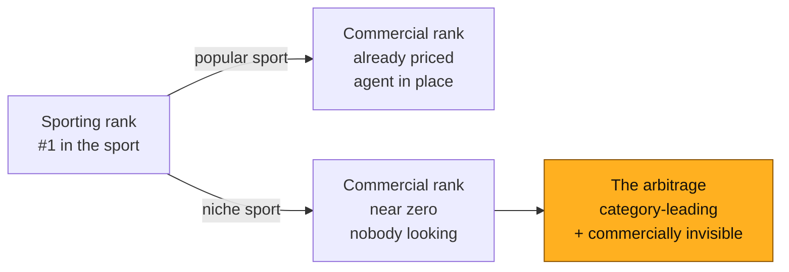
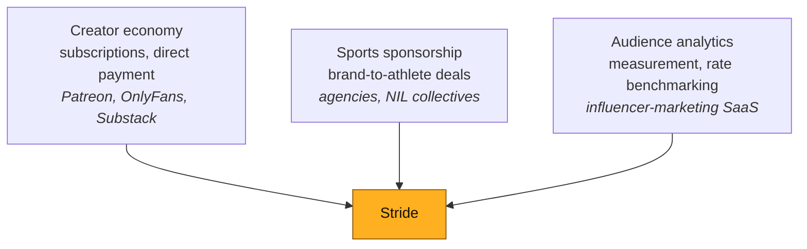
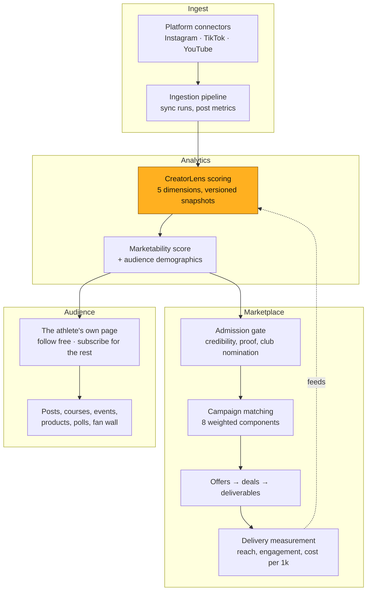
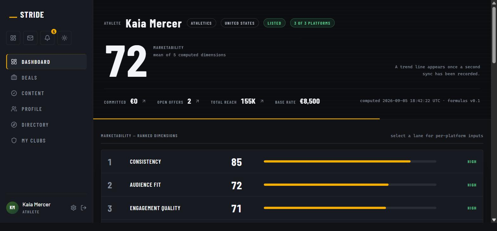
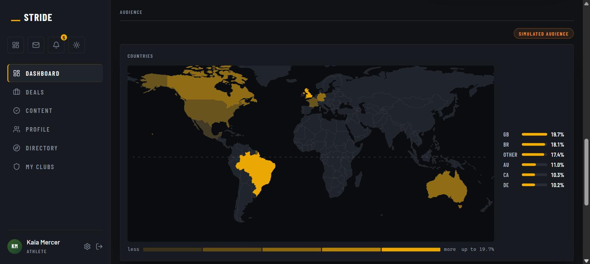
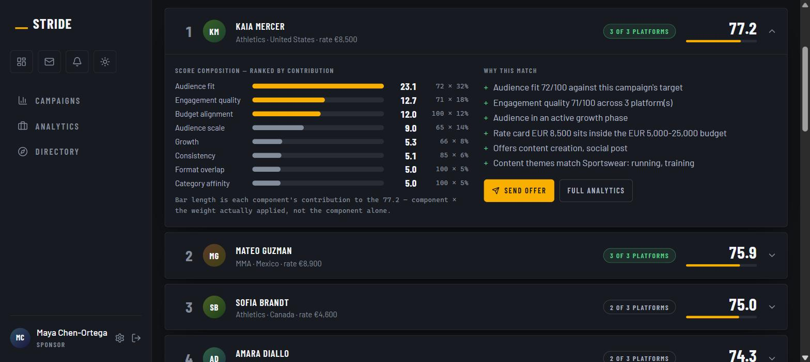
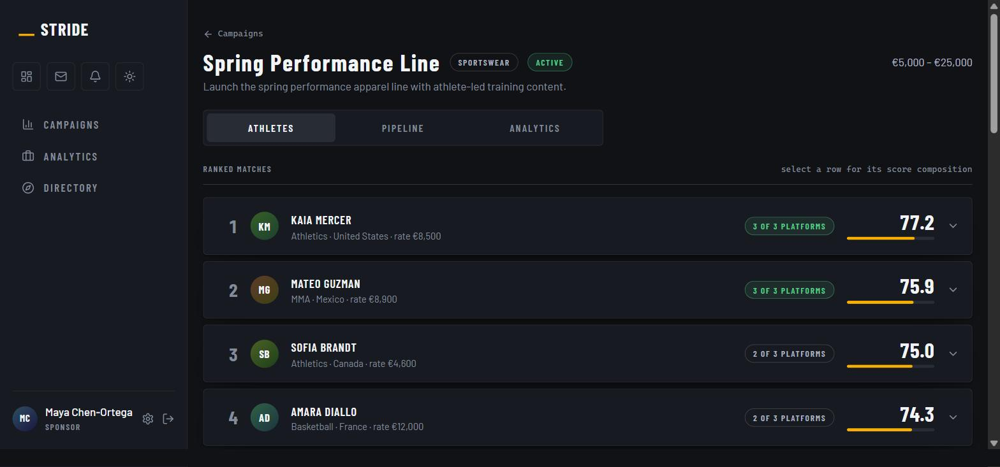
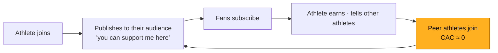

> [!abstract] How to read this
> This is a **preliminary draft** assembled for review, not a finished document.
> Every euro figure is generated from the financial model in this repository and
> re-checked by an automated guard, so the numbers are internally consistent —
> but the *assumptions behind them* are arguments, not facts, and Section 7 says
> which ones would hurt most if wrong.
>
> Where a figure is an estimate rather than a model output, it is marked
> **`[estimate]`**. Where research is still owed, it is marked **`[to research]`**.

> [!example] 📷 ==PHOTO P1 — the opening image==
> A trail runner mid-race, shot from behind, **small in a large landscape**.
> The point of the image is scale: one athlete, a big empty market.
> **File** · `attachments/hero-trail-runner.jpg` — not taken yet.
> **Licensing** · Stock is fine here. A real athlete is better, and needs a
> written release before it goes in a deck shown to investors.

---

# 1 · Executive Summary

**Stride is a creator platform with a sponsorship feature.**

Athletes are creators with a second payer. OnlyFans proved direct fan
monetisation beats ad-share; nobody has built it for athletes — who, unlike
lifestyle creators, also have sponsors, clubs, and a competitive record that
makes their audience *measurable*. Fan revenue leads and funds the early years.
Sponsorship compounds behind it.

### The thing most people get wrong

You do not start with famous athletes. You start where **sporting rank and
commercial value have come apart**.

| | Popular sports | Niche sports |
|---|---|---|
| Does an agent exist? | Yes, for the top. The tail is ignored | **No** |
| Athlete's alternative to us | An agent at 10–20%, if one will take them | **Nothing** |
| What we sell | Disintermediation | **Market creation** |
| Cost to acquire an athlete | €40 → €88 | **€16 → €36** |
| Who we compete with | Agencies who defend | **Nobody** |

### The numbers

| | Y3 | Y7 |
|---|---|---|
| Net revenue | €1.04M | €26.52M |
| EBITDA | €-274k | €9.99M |
| Active athletes | 5,500 | 52,000 |
| Paying fans | 46,333 | 759,408 |
| Gross margin | 69% | 73% |

EBITDA turns positive in **Y4**. Total capital to fund the plan: **€625k**
(peak burn €446k plus a 40% buffer). Take rates are published and fixed: **15%
on fan revenue, 10% on sponsorship**, no monthly athlete fee.

> [!example] 📊 ==GRAPH G1 — the plan in one frame==
> **Chart** · Revenue as columns, EBITDA as a line, one shared € axis, a zero
> rule the line crosses in Y4. Shade Y1–Y3 lightly and label the band *funded
> by the raise*.
> **Data** · `attachments/chart-data/g1-revenue-ebitda.csv`
> **Must say** · The loss is small, bounded and ends in Y4 — €274k at its worst,
> against €9.99M seven years out.
> **Watch** · Y1 revenue is €29k. On a linear axis it is one pixel; that is
> fine, and truer than a log axis that flatters the early years.

### The ask

**€400k pre-seed at €2.5M pre-money**, gated on evidence rather than milestones:
400 athletes · €10k MRR · anchor athlete public · payments processing real money
· **fan churn measured for three months.**

### What we would rather tell you than have you find

The plan rests on one assumption: that niche-sport fans churn **45% slower** than
the Patreon benchmark. Nothing in the product proves it, and the financial model
*understates* the risk by construction — it treats fan counts as targets and does
not charge for fan acquisition. See [[#7 · Risk Register]], risk **R1**.

---

# 2 · The Problem

## 2.1 The athlete

Consider a real profile — the kind we designed the product around.

> [!example] María, 27, trail runner
> Third at the national championship. 24,000 Instagram followers, 78% of them in
> Spain, most of them people who *also run*. She has:
> - no agent — none will take her, the commissions are too small
> - four unanswered brand DMs from the last six months
> - no idea what a post is worth, and no way to find out
> - a full-time job, because trail running does not pay
>
> Her audience is small, dense, and commercially excellent. Nobody has told her
> that, and no one is going to.

> [!example] 📷 ==PHOTO P2 — the athlete this plan is about==
> A portrait in their environment — a padel court at a municipal club, or a
> trail runner at a start line. **Not a hero shot**: an ordinary competitor at
> an ordinary event.
> **Caption** · Name their sport, national ranking and follower count, so the
> reader sees the gap for themselves rather than being told about it. This is
> the same argument as **G2**, made by a face instead of an axis.
> **File** · `attachments/athlete-portrait.jpg` — not taken yet.
> **Licensing** · ==A named, ranked, real person needs a signed release.== If
> one is not available, use an unidentifiable shot and put the ranking in the
> caption without the name.

## 2.2 The three failures

**1 · Discovery fails.** A running-shoe brand wanting fifty authentic trail
athletes has no way to find them. There is no database, no rate benchmark, no
agency covering the segment. The brand defaults to one famous athlete at ten
times the price and a fraction of the relevance.

**2 · Pricing fails.** María cannot price herself because there is no public
comparable. Brands exploit this — not maliciously, they simply have no reference
either. Deals get made at whatever number is said first.

**3 · Monetisation fails entirely.** Even with a devoted audience, there is no
path from *audience* to *income* unless a brand happens to appear. Her followers
would pay for her training plans. There is nowhere for them to do it.

## 2.3 The reframe — the rank arbitrage

This is the insight the whole plan turns on, and it is worth stating precisely.

> [!important] Sporting rank and commercial value are coupled in popular sports and decoupled in niche ones
> In football, the market has already priced every point on the curve. A
> mid-table player has an agent, a club commercial department, and image rights
> that may not even be his to sell. There is no gap to arbitrage.
>
> In trail running, you can sign **the best athlete in the country** — and she is
> not "a top athlete" by any commercial definition, because the sport is small.
> She is simultaneously *category-leading* and *commercially invisible*.
>
> **That gap is the business.**

Why the gap is worth money rather than just being a sad fact:

- **Brands do not buy fame. They buy audience × relevance × price.** A national
  champion in trail running is more relevant to a running-shoe brand than a
  mid-table footballer with five times the following — and costs a fraction.
- **Niche audiences are practitioners, not spectators.** People who follow a
  trail runner *run*. They buy shoes, gels, packs, watches. A football fan
  watches football. Conversion differs by more than an order of magnitude.
- **Nobody is bidding.** No agency, no platform, no competitor. Acquisition cost
  is €16 in Y1 against €40 for a popular-sport athlete, and the difference is
  structural, not temporary.



> [!example] 📊 ==GRAPH G2 — the decoupling, drawn==
> **Chart** · Scatter. X = sporting rank in the sport (best on the left),
> Y = annual sponsorship income. Two series: a popular sport, where the points
> fall along a tight curve, and a niche one, where they lie flat along the
> bottom. Circle the top-left corner of the niche series — a national champion
> earning nothing — and label it *the arbitrage*.
> **Data** · ==Illustrative, and it must say so on the chart.== Nothing in the
> repo measures athlete income; this is the argument in §2.3 drawn, not a
> finding. A real version needs the federation and income data §9.1 asks for,
> and would be the single most valuable exhibit in the deck.
> **Must say** · In one sport the two axes are the same line. In the other they
> are unrelated. That is the whole business.

## 2.4 Why now

**TEKTA launched 19 August 2026** — Publicis Sports, 3 Arts Sports, Travis Kelce.
A major agency has just validated that athlete monetisation is a category worth
building for. It also built the thing this thesis exists to remove: a
human-mediated consultancy, gated to *"a select group of Publicis Sports
clients"*, US college NIL, **no fan monetisation at all**.

They are the incumbent in our disintermediation pitch, not a competitor in our
marketplace one. Their economics *require* excluding the athlete we start with.

---

# 3 · Market

## 3.1 Industry overview

Three markets converge here, and Stride sits in the overlap.



**What each market proves for us:**

| Market | The proof it provides | The gap it leaves |
|---|---|---|
| Creator economy | Fans pay creators directly, at scale. Patreon: **10M paying members** across **286,287 creators** with ≥1 paying member | Nothing sport-specific. No sponsor side. No competitive record to price against |
| Sports sponsorship | Brands spend heavily on athlete association | Human-mediated, top-heavy, opaque pricing, ignores the long tail entirely |
| Influencer analytics | Audience can be measured and priced | Built for lifestyle creators; sport-specific signals (competition level, practitioner audience) are absent |

## 3.2 Macroeconomic context

> [!note] Directionally supportive, not load-bearing
> None of the plan's revenue depends on these holding. They are tailwinds, and
> we would rather name them as such than build on them.

- **Creator-economy spend keeps shifting from ad-share to direct payment.** The
  economics favour it: a direct subscription retains far more per euro than an
  ad impression. `[estimate]`
- **Brand budgets are moving from broadcast sponsorship to measurable,
  smaller-scale athlete partnerships** — the same shift influencer marketing went
  through a decade ago. `[to research: quantify with EU sponsorship spend data]`
- **Padel and trail running are in genuine structural growth in Europe**, not
  cyclical. Padel in Spain in particular. `[to research: federation licence
  counts, 2019→2026]`
- **Interest rates and a harder funding market** favour a plan that reaches
  EBITDA-positive in Y4 on €625k, rather than one that needs €10M to find out.

## 3.3 Market sizing

> [!warning] This is the weakest-evidenced section in the draft
> A rigorous TAM needs federation licence data we do not yet have. The funnel
> below is transparent about every step so each can be challenged and replaced.
> **The plan does not depend on the TAM** — it depends on the SOM, which is the
> model's own athlete targets, defended separately in §6.

**Bottom-up, EU-27 + UK:**

| Step | Figure | Basis |
|---|---|---|
| Population | ~520M | Eurostat |
| Regularly participate in organised sport | ~20% ≈ 104M | `[estimate]` |
| Compete at club level or above | ~8% of those ≈ 8.3M | `[estimate]` |
| **In niche sports** (excl. football/basketball majors) | ~55% ≈ 4.6M | Sport index segmentation |
| With ≥5,000 social following — i.e. a monetisable audience | ~3% ≈ **138,000** | `[estimate]` — the softest number here |
| **TAM** — annual revenue if all monetised at model ARPA | **≈ €70M** `[estimate]` | 138k × ~€510 blended net revenue per athlete at maturity |

> [!example] 📊 ==GRAPH G3 — the funnel, on a log axis==
> **Chart** · Horizontal bars, **logarithmic** — 520M to 52,000 is four orders
> of magnitude and a linear axis renders the last four bars as nothing. Colour
> the two `[estimate]` steps differently from the sourced one and put the basis
> on each bar.
> **Data** · `attachments/chart-data/g3-market-funnel.csv`
> **Must say** · Two things at once: the funnel is transparent, and **SOM sits
> almost on top of SAM** — the tension this section admits to. Draw SAM and SOM
> as adjacent bars so a reader sees the gap close rather than reading about it.

**SAM — the reachable subset by Y7:** Spain, Portugal, France, Italy, Nordics,
UK. Roughly **40% of the above ≈ 55,000 athletes ≈ €28M**.

**SOM — what the plan actually claims:** **52,000 athletes and €26.5M of net
revenue by Y7.** That is close to the whole SAM, which is the honest tension in
this section and the reason it needs real data. Two readings:

1. The SAM estimate is too conservative — the ≥5k-followers filter at 3% is a
   guess, and the true figure is likely higher.
2. The Y7 athlete target is ambitious and should be stress-tested against
   federation data before it appears in front of an investor.

**Both are probably true.** `[to research]` is the honest label on this whole
subsection, and it is the highest-value research task in the plan.

## 3.4 Where we start — the sport index

We built a **714-pair opportunity index** (34 countries × 21 sports) scoring
supply, fandom, monetisability, sponsor demand and agent density.

**Top opportunities, all niche, all practitioner-audience:**

| # | Sport | Country | Score |
|---|---|---|---|
| 1 | running / trail | Finland | 80.6 |
| 2 | running / trail | Sweden | 80.5 |
| 3 | running / trail | Denmark | 80.0 |
| 4 | running / trail | Australia | 78.9 |
| **5** | **padel** | **Spain** | **78.2** |
| 6 | running / trail | United Kingdom | 77.7 |

**Spain, ranked:**

| Sport | Score | Segment | Audience |
|---|---|---|---|
| **padel** | **78.2** | niche | practitioner |
| **running / trail** | **74.9** | niche | practitioner |
| fitness / gym | 71.1 | niche | practitioner |
| cycling | 66.3 | niche | practitioner |
| athletics | 53.1 | popular | mixed |
| football | 53.1 | popular | spectator |

> [!example] 📊 ==GRAPH G4 — 714 pairs, and where Spain sits in them==
> **Chart** · Scatter of all 714 country × sport pairs. X = supply (athletes
> available), Y = demand (sponsor appetite), point size = score, colour = niche
> vs popular. Grey out everything, then light up **padel · Spain** and
> **running/trail · Spain**, labelled. Optionally a small ranked bar chart of
> the top ten beside it.
> **Data** · `attachments/chart-data/g4-sport-index.csv` — all 714 rows, with the
> `country_confidence` column so *measured* and *estimated* countries can be
> drawn differently.
> **Must say** · The launch choice fell out of a repeatable method applied to
> 714 candidates, not out of the founders being Spanish. The cloud is the
> evidence; the two lit points are the decision.

> [!tip] The launch decision writes itself
> We are a **Spanish company**. Spain's two best-scoring sports are **padel**
> and **trail running**, both niche, both practitioner-audience, both in growth.
> We start at home, in the two sports where the index says we should — and the
> index is a repeatable method, not a hunch, so the second market is chosen the
> same way.

**There is no single launch sport.** The index is context, not a gate. Athletes
are judged on audience, consistency, professionalism and willingness to publish;
sport is one input.

## 3.5 Competitive landscape

| | What they are | Fan monetisation | Long tail | Our relationship to them |
|---|---|---|---|---|
| **TEKTA** (Publicis/Kelce) | Agency consultancy, human-mediated | None | Excluded by design | The incumbent we disintermediate |
| **Traditional agents** | 10–20% for introductions | None | Won't take them | Same |
| **Patreon / Substack** | Creator subscriptions | Yes | Yes | Proof the demand exists; no sport context, no sponsor side |
| **Passes / Fanfix** | Creator platforms, some athletes | Yes | Partly | Closest analogue. Monthly creator fee — the pricing mistake we price against |
| **Influencer SaaS** (Aspire, Grin) | Brand-side discovery tools | No | Weak in sport | Sponsor-side only; no athlete relationship |
| **NIL collectives** (US) | College-athlete payment vehicles | No | US-only, regulatory | Different market, different legal frame |

**Nobody occupies our square:** self-serve, long-tail, EU, fan revenue *and*
sponsorship, priced transparently.

> [!example] 📊 ==GRAPH G5 — the empty corner==
> **Chart** · 2×2. X = reaches the long tail, Y = monetises fans directly.
> Place the six competitors from the table above, then place Stride in the
> top-right — where the only other occupant is Patreon, which has no sponsor
> side. Annotate Stride's point with the third axis the square cannot show:
> *and a sponsorship market on the same account*.
> **Data** · `attachments/chart-data/g5-competitive-map.csv` — ==the coordinates are
> editorial placements of the table above, not measurements.== The CSV exists so
> the chart is reproducible, not so it looks quantitative. Do not add a
> numbered axis.
> **Must say** · The corner is empty, and it is empty for a structural reason —
> agencies cannot serve the tail at their cost base, and creator platforms have
> no reason to build a sponsor side.

### Our defensibility, honestly assessed

| Moat | Strength | Why |
|---|---|---|
| Measured athlete data | **Strong, compounding** | Every synced account deepens the pricing benchmark nobody else has |
| Two-sided liquidity | **Strong once dense** | Sponsors come for supply; athletes come for demand |
| Brand with communities | **Medium** | Real but slow, and losable |
| Technology | **Weak alone** | Reproducible in months by a funded team |
| Take-rate pricing | **Weak alone** | Trivially copied |

The defensibility is the **data and the liquidity**, not the code. Which is why
the plan spends on athlete acquisition rather than on engineering headcount.

---

# 4 · Technology

## 4.1 How it works

A working product, not a prototype — end to end, in CI, on two databases. Every
screenshot below is the running application, not a mock-up.



### The athlete connects an account, and gets a number they can argue with

One score, five dimensions, each with the evidence behind it. Coverage is stated
rather than hidden: two connected platforms means a two-platform score, and it
says so. Nothing here is a projection — every figure traces to posts the athlete
actually published.



The audience behind that score is aggregated only — age bands, gender split,
country shares. No row in the schema can identify an individual follower,
because no such data is ever requested from a platform. The chip is not
decoration: platform connectors are mocked in this build, and every surface that
shows an audience says so.



### The sponsor briefs a campaign, and gets a ranking that shows its working

This is the single most important screen in the product. Each match is a
weighted sum the sponsor can take apart: bar length is each component's
*contribution* — the component multiplied by the weight actually applied — so
the chart ranks what drove the match rather than which raw number happened to be
largest. The reasons beside it are generated from the same arithmetic, not
written by hand.



The same ranking, collapsed, is the sponsor's shortlist. Coverage sits on every
row, because a score from one platform is not the same claim as a score from
three.



### The offer, the deliverables, and what actually happened

An offer becomes a deal; a deal requires at least one attached deliverable
before it can be completed. Delivery is then measured against the projection
captured **at offer time**, so variance is a real comparison rather than a
number chosen after the fact. A deal marked complete with nothing attached
reads as unmeasured, never as zero.

### The audience side — free to follow, paid to see the rest

Following is free and public. Subscribing is what opens the lock. They are
different relationships in the schema, not two words for one, and the difference
is the whole fan-revenue thesis.


The wall mixes what the athlete writes with the platform activity their
connected accounts produce. Platform items carry a very light wash of that
platform's own colour — 5–7% behind a coloured edge — and the label names the
platform too, so colour is never the only carrier. A locked post shows its
title, its tier and what sits behind it, and nothing else: no thumbnail leaks
through the blur.


### And the directory a sponsor browses


**Three design decisions worth a diligence call:**

1. **Every match score decomposes.** Eight components, each weighted, arithmetic
   visible — `audience fit 72 × 32% = 23.1`. No black-box ranking. (The *score*
   has five dimensions; the *match* adds budget alignment, format overlap and
   category affinity to make eight.)
2. **Missing data is `null`, never `0`.** An unmeasured campaign reads as
   unmeasured, not free. A dimension we could not measure is *excluded from the
   score*, not counted as zero.
3. **Nothing self-verifies.** A club above the verification threshold still waits
   for a human to open its roster page. A rejected proof cannot be cleared by
   re-submitting the form.

> [!note] What the demo will and will not do
> Sign in at any of the five demo accounts and the whole flow above runs on
> seeded data. **No money moves anywhere in it.** The €9.99 on the membership
> card is a label, not a price: there is no tier entity, no billing, and no
> payment processor. That is §4.2, and it is the honest boundary between what
> is built and what is funded by this plan.

## 4.2 What must still be built

The phase table below has moved since the first draft, and it has moved in one
direction: the **content** half of P1 and P2 shipped, and the **money** half did
not. That is worth being precise about, because it changes what this plan is
asking to fund.

| Phase | Ships | Status | Gate |
|---|---|---|---|
| **P0** | Stripe Connect, athlete KYC | **Not started** — the whole of it | — |
| **P1** | Tier entity with prices, recurring billing, entitlement expiry, dunning | **Half built.** Posts, courses, events, products, polls, the free/locked split and the subscribe relationship all exist and are demonstrable. What is missing is everything that charges: there is no tier entity, no price, no renewal, no expiry | **Pre-seed** |
| **P2** | Video transcode, object storage, CDN, automated moderation | **Half built.** Image and video upload are accepted, size-capped and signature-checked where the container has a signature to check, then served; locked delivery works; the athlete age gate takes a full date of birth and refuses anyone under 16; block, report and an admin review queue exist. What is missing is transcoding, a CDN decision, and automated classification ahead of the human queue | Pre-seed → Seed |
| **P3** | Deal payments, escrow, sponsor billing plans | **Not started.** Deals record an amount and a status; no money moves | Seed |
| **P4** | DAC7, refunds/disputes, multi-currency | **Not started** | Series A |

Shipped alongside, and not previously on this table because a first draft did
not think to ask for it: **account safety and data rights.** Terms acceptance
recorded against the version shown, email verification, password reset, change
of address, six of six GDPR rights live including a one-click export and an
erasure that anonymises the person while keeping the deal records an accounting
duty requires. None of it is a feature anyone will pay for. All of it is a
precondition for putting a real person in front of the product, and it is done.

> [!important] P1 is still the whole ballgame — and it is now a smaller bet
> The question has not changed: **will fans of a semi-professional athlete pay
> €9.99 a month?** What has changed is the cost of asking it. The first draft
> put a content layer, a paywall and a billing system between here and the
> answer. Two of those three exist. What stands between this plan and its own
> most important experiment is **a payment processor and a tier that has a
> price**, against a content surface that already publishes, locks and delivers.
>
> The €9.99 on the membership card today is a label rendered by the client.
> There is no tier entity behind it. That single sentence is the honest summary
> of the gap.

## 4.3 The fan product — specification

> [!warning] This was the least-built part of the plan. It is now the least-*paid* part
> **87% of Y1 revenue is fan subscriptions.** When this section was first
> written it was a specification for something that did not exist: there was no
> content object of any kind, and a fan could follow an athlete and see a
> sparkline and nothing else.
>
> Most of what follows now describes the product rather than proposing it —
> the content types in 4.3.2, the free layer in 4.3.1, the sponsored and
> highlighted labels in 4.3.4, and clubs as publishers in 4.3.5 are all built.
> What is *not* built is the part that takes money: the tiers in **4.3.3** are
> a schema column and a display string, not a price anyone can pay. Read this
> section as a description with one specification-shaped hole in the middle of
> it, and read 4.3.3 knowing that is the hole.

### 4.3.1 The free layer — the reason to open the app

Following an athlete is free and always will be. A free follower sees:

| | Source | Build cost |
|---|---|---|
| Their public social posts, aggregated | **Already ingested.** The connectors sync posts to compute marketability — the same rows render as a feed | **Near zero** |
| News and articles about them | New ingestion: news API + RSS, matched on athlete name and sport | Moderate. Attribution and excerpt-length rules apply |
| Competition results and score movement | Already in the product | Zero |

> [!tip] The free layer is nearly free to build
> The analytics pipeline already pulls every post to score it. **The same data
> that prices an athlete for sponsors is the content that keeps a fan opening the
> app between paid drops.** One ingestion, two products — which is also why a
> general creator platform cannot copy this cheaply: they have no reason to have
> built the measurement side first.

The free layer exists to solve the retention problem that kills creator
subscriptions: nothing to come back for between posts. A fan who opens the app
weekly for free news converts far better than one who must decide to subscribe
cold.

### 4.3.2 Content types

Four types, and the split that matters is **unlimited vs scarce**.

| Type | What it is | Scarce? | Pricing model |
|---|---|---|---|
| **Post** | Text, photo, later video. Training logs, race reports, gear notes | No | Tier-gated |
| **Course** | An *ordered series* with progress and completion — "12-week hill block" | No | Tier-gated, or one-off unlock |
| **Session** | Scheduled, one-to-many, remote — Q&A, watch-along, technique review | Semi | Tier-gated with a cap |
| **Event** | **Physical, capacity-limited, dated, located** — "come train with me", a club open session, a media appearance | **Yes** | One-off purchase or subscriber ballot |

> [!important] Scarcity is what justifies the top tier
> Posts and courses cost nothing to serve to one more fan. **Events cost the
> athlete a Saturday.** That difference is the whole argument for a €24.99 tier
> and for one-off purchases existing alongside subscriptions — and it is why
> "come train with me" cannot simply be a subscriber perk with unlimited
> redemption. It is a capacity-managed product, closer to a race entry than to a
> Patreon post.

### 4.3.3 Tiers

| Tier | Price | Includes |
|---|---|---|
| **Follow** | Free | Aggregated posts, news, results, score movement |
| **Supporter** | €4.99 | + members-only posts, training logs, early race reports |
| **Insider** | €9.99 | + course series, group sessions and Q&A |
| **Inner circle** | €24.99 | + event access or ballot priority, direct message window |
| **Season pass** | €89/yr | Insider for a year — the churn lever, priced at ~9 months |

These four are the whole set. They live in `market_model.py` and everything else
reads them — the retention table, the fee table in §2 of the cost model, and this
document.

A fifth tier at €14.99 used to exist in **two hand-typed copies of the fee table
and nowhere else**: not in the tier design, not in the pricing decision, not in
the model's inputs. Both copies are generated now. A duplicated price is a price
that drifts, and this one drifted in two directions at once — one copy invented a
tier, the other priced the season pass at €99.

Assumed mix **40 / 50 / 10** across the three monthly tiers. That mix produces
**€9.49**, which is the *mature niche* subscription ARPU — not a blend across the
plan. The model ramps to it: niche **€8.00 → €9.50** and popular **€7.00 → €8.30**
over the ten years, because early cohorts skew to the cheap tier and the mix
improves as the product does. `[to research: replace the mix with real data after P1]`

### 4.3.4 Labels — sponsored and highlighted

Two labels, and they do different jobs.

- **`sponsored`** — a brand paid for this content. This is a **disclosure
  obligation, not decoration**, and it connects to work already shipped: the
  product carries a per-country disclosure module that tells an athlete which
  tags they must use. Sponsored content *inside a paywall* is a different
  regime from a sponsored social post, and the rule set needs extending.
  `[to research: EU rules for disclosure behind a paywall]`
- **`highlighted`** — the athlete or club is merchandising this item to the top
  of their feed. Purely presentational, no legal weight.

> [!note] Sponsored content is the bridge between the two revenue engines
> A brand pays for a course; the athlete's subscribers get it; the sponsorship
> deal is measured by the same delivery pipeline that already exists. It is the
> first place where fan revenue and sponsorship revenue touch the same object,
> and the measurement engine is already built for it.

### 4.3.5 Clubs as publishers — new, and not in the model

Clubs today can only sell **sponsorship** packages. They should also publish fan
content, for three reasons:

1. **A club has an audience no individual athlete has** — the club's own
   followers, its members' families, its local community.
2. **It solves cold start.** A club with 30 athletes can publish from day one,
   while individual athletes are still building. The club channel is already the
   cheapest acquisition route in §5.2; this makes it a revenue route too.
3. **Club content is naturally event-shaped** — open sessions, academy days,
   "train at our club" — which is the scarce, highest-margin type.

**Two design questions this opens, both unanswered:**

| Question | Why it matters |
|---|---|
| When a club publishes content featuring an athlete, how does revenue split? | Three-way split (fan → club → athlete → Stride) is materially more complex than the two-way one built today |
| Does a fan subscribe to a *club*, an *athlete*, or both separately? | Determines whether the subscription object hangs off `athlete_profiles` or becomes polymorphic — a schema decision, cheap now and expensive later |

> [!danger] The financial model does not contain club fan revenue
> Its three revenue lines are per-athlete fan revenue, sponsorship, and sponsor
> SaaS. Club packages feed the *sponsorship* line. **So every euro of club-published
> fan content is upside the plan does not claim** — which is the honest way round,
> but it also means the model cannot yet be used to size this decision.

### 4.3.6 What this changes about the build

The P1 line in §4.2 reads *"tiers, subscriptions, entitlements, simple text/photo
posts"*. That is the **minimum** to test the assumption in §7 R1, and it remains
the right first build. This specification is the shape P1 grows into — sequenced
so nothing here blocks the churn measurement that gates the pre-seed:

| | Ships | Why then |
|---|---|---|
| **P1** | Free feed (from existing ingestion), posts, tiers, entitlements | Tests "will fans pay" for the least possible money |
| **P1.5** | Courses, sponsored/highlighted labels | Raises ARPU without new infrastructure |
| **P2** | Video, sessions | Needs transcode and moderation |
| **P2.5** | Events with capacity and ballots, club publishing | Needs the revenue-split decision above |

## 4.4 Infrastructure and the cost that decides viability

Content delivery is the cost that kills naive versions of this business.

| | Egress per GB | Total Y7 infrastructure |
|---|---|---|
| Naive (CloudFront list price) | €0.075 | €1.52M |
| **Zero-egress CDN architecture** | **€0.008** | **€419k** |

At **1.8 GB per fan per month**, the egress *rate* differs by **9.4×**. Total
infrastructure differs by **3.6×** — compute and storage are unaffected — which
is **€1.1M a year at Y7** and **€7.8M cumulative across the plan**.

In margin terms it is **4.1 points of gross margin at Y7** (72.8% → 68.6%). Not
existential, and we would rather size it correctly than call it existential: it
is a design-time architecture decision worth roughly one engineer-decade of
salary, taken once, at the start.

**Infrastructure trajectory:**

| | Y1 | Y3 | Y5 | Y7 |
|---|---|---|---|---|
| Infrastructure | €3k | €33k | €181k | €419k |
| Payment processing | €8k | €245k | €1.94M | €6.04M |
| Moderation | €1k | €17k | €79k | €165k |
| Athlete verification | €1k | €9k | €30k | €43k |

**Payment processing is the dominant COGS line — larger than infrastructure by
14× at Y7.** No amount of engineering removes it; it is why gross margin lands
in the low 70s rather than a SaaS 80%+, and pretending otherwise would be the
easiest way to lose credibility with anyone who has run a marketplace.

> [!example] 📊 ==GRAPH G11 — what the cost of revenue is actually made of==
> **Chart** · Stacked columns, Y1–Y7: payments, infrastructure, moderation,
> verification. Overlay the naive-infrastructure figure as a dashed line so the
> egress decision is visible as the gap between it and the real infrastructure
> band.
> **Data** · `attachments/chart-data/g11-cogs-composition.csv`
> **Must say** · The reflex on hearing "content platform" is a bandwidth bill.
> **It is a payments bill** — €6.04M against €419k at Y7. The architecture
> decision is real and worth taking; it is not the thing that decides the
> margin.

## 4.5 Team and scaling

| | Y1 | Y2 | Y3 | Y4 | Y5 | Y7 |
|---|---|---|---|---|---|---|
| Headcount (FTE) | 1.5 | 3.0 | 7.0 | 14.0 | 24.0 | 50.0 |
| People cost | €57k | €156k | €420k | €896k | €1.58M | €3.50M |

**Hiring sequence, and the reasoning:**

| Stage | Hires | Why then |
|---|---|---|
| Pre-seed (Y1–Y2) | 1 full-stack, 1 community/athlete lead, 0.5 ops | The product exists. The bottleneck is athletes, not features |
| Seed (Y3) | +2 engineering, +1 sponsor sales, +1 ops/review | Two-sided liquidity needs a demand side |
| Y4–Y5 | Engineering to 8, sales to 4, ops to 6, data to 2 | Second market, moderation load, learned ranking |
| Y6+ | Managed services, agency channel, EU compliance | Category leadership |

> [!note] The review queue is the hidden operational cost
> Manual proof review runs at ~4 minutes each and **250 reviews per 1,000
> applicants**. At Y7 volumes that peaks at roughly **0.6 of one FTE** — small,
> but the *latency* matters more than the cost: an athlete in the queue is not
> listed, not matchable, and not earning. Automated proof-checking already ships
> for the unambiguous cases; everything else stays with a human, deliberately.

---

# 5 · Go-to-Market, Marketing & Partnerships

> [!important] The strategic premise
> Niche sports are not small versions of big sports. They are **communities** —
> dense, physically co-located, highly sceptical of marketing, and connected by
> clubs, races and federations rather than by broadcast. You cannot buy your way
> in. You have to show up where they already are.

## 5.1 What we will not do, and why

| Not doing | Why |
|---|---|
| Paid social to acquire athletes | Highest-cost, lowest-trust channel in a community that detects marketing instantly. Signals desperation |
| Influencer marketing about influencer marketing | Corrosive to the credibility the whole product depends on |
| Chasing a famous athlete as a launch stunt | Proves fame monetises — which nobody doubted, and which **does not generalise downward** to the long tail the model is built on |
| Broad multi-sport launch | Community trust is per-community. Depth beats breadth until the loop is proven once |

## 5.2 The five channels

### 1 · The rate card as content — our single best marketing asset

Nobody in these sports knows what they are worth. **We do.**

Publishing *"What is a trail runner with 20,000 followers actually worth?"* —
with real, anonymised, measured benchmark data — is the most shareable artifact
that exists in these communities, because it answers the question every athlete
in them has privately wondered and none can answer.

- It gets forwarded in every club WhatsApp group without us asking.
- It is **marketing that is literally the product** — the measurement engine,
  shown working.
- It is defensible: we have the data, and competitors do not.
- It compounds: every athlete who joins makes the next benchmark better.

> [!tip] Content calendar built from the index
> The 714-pair index is a content engine. *"The ten best countries in Europe to
> be a professional climber, commercially"* · *"Padel's commercial gap: Spain
> vs Sweden"* · *"Why your sport pays less than the one next to it."* Each post
> is a genuine finding from real data, and each ends at a product that proves it.

> [!example] 📷 ==PHOTO P3 — why the race-day channel works==
> A race expo or tournament village: crowded, branded, physical. The argument
> the image makes is **density** — every person in frame is a practitioner,
> which is the whole reason this channel converts.
> **File** · `attachments/race-expo.jpg` — not taken yet.
> **Licensing** · Crowd shots at a public event are the easy case. Avoid frames
> where a single identifiable person is the subject, and avoid other brands'
> logos being the most legible thing in the picture.

### 2 · Race-day and tournament presence — where 100% of them are

Niche sports congregate **physically**, at predictable times, in one place.

- A trail race expo is 2,000 people of whom ~100% are practitioners and perhaps
  50 have a monetisable audience.
- A padel tournament weekend is the same shape.
- **Cost per qualified athlete conversation is lower than any digital channel**,
  and the conversation is face to face, which in a sceptical community is worth
  more than ten impressions.

`[to research: expo costs for 3–5 target Spanish events, 2027 calendar]`

### 3 · Club-down, not athlete-up

**One conversation with a club is 20–40 athletes.** The club channel is already
built into the product: verified clubs can nominate athletes, which raises the
athlete's credibility floor without letting the club bypass the gate.

- Clubs want their athletes earning — it retains them and makes the club
  attractive to join.
- Clubs have packages of their own to sell (already in the product).
- The nomination budget is bounded by the roster size the club declares, which
  makes inflating it a checkable claim rather than free headroom.

### 4 · Federations — the highest-leverage partnership

Niche-sport federations are **poor, under-resourced, and want their athletes to
earn**. They also have the complete list of licensed athletes in the country —
the exact dataset our market sizing lacks.

**The offer:** free analytics tooling for the federation and its athletes, in
exchange for introduction to the roster and co-marketing.

**Why they say yes:** it costs them nothing, it looks like they are doing
something for athletes who otherwise get nothing, and it makes their sport more
attractive to sponsors — which is their own mandate.

**Targets:** Federación Española de Pádel, Real Federación Española de
Atletismo (trail/mountain), regional Catalan federations.
`[to research: named contacts, existing commercial programmes]`

### 5 · The athlete as the channel

**Every athlete who joins markets to their own audience for free.** This is the
only channel that compounds without spend:



This loop is why **niche CAC is €16 against €40 for popular sports** — and why
it *falls* relative to revenue as density grows within a sport. Referral is the
default motion in a community where everyone races against each other monthly.

## 5.3 The anchor athlete — the single most important hire that is not a hire

The Y1 plan needs **one** athlete who is:

- **category-leading** in their sport (national-level or better),
- **audience-rich relative to their sport** (20k+, engaged, practitioners),
- **publicly willing** to say what they earn,
- and **articulate** about why it matters.

They are not an endorsement. They are the **proof**, and they will be quoted in
every subsequent conversation with an athlete, a federation and an investor.

> [!warning] This is a gating dependency, not a marketing task
> The pre-seed gate requires *"anchor athlete public"* for a reason: without one,
> there is no fan-churn data, and without churn data the plan's central
> assumption stays untested. Identifying and signing this person is the
> highest-priority action in the plan. `[to research: 5–10 named candidates in
> Spanish padel and trail]`

## 5.4 Sponsor-side acquisition

Sponsors are the **second** side and deliberately later — but not absent.

| Phase | Motion |
|---|---|
| Y1–Y2 | Founder-led, 10–20 regional brands. Free while supply densifies |
| Y3 | Self-serve + inbound from the content engine. First paid SaaS tiers |
| Y4+ | Sales org, agencies as *customers* rather than competitors |

**The pitch, once niche proof exists:** *"Here is what athletes in our network
earn from fans. Here is what your agency charges for introductions we make on
measured evidence."* That argument is quantified, and it needs the niche cohort
to exist first.

## 5.5 Brand and positioning

**Position:** the platform that tells athletes the truth about what they are
worth.

**Tone:** measured, unhyped, specific. The product refuses to show a zero where
it means "unknown" — the marketing should have the same discipline. In a
community that distrusts marketing, *accuracy is the differentiator*.

**What we never say:** "the next big thing in sports", any variant of "empowering
athletes", or any number we cannot show the derivation of.

---

# 6 · Financials

## 6.1 Revenue streams

| # | Stream | Take | Live? |
|---|---|---|---|
| 1 | Fan subscriptions | **15%** | P1 |
| 2 | Pay-per-view / unlocks | 15% | P2 |
| 3 | Tips | 15% | P1 |
| 4 | Sponsorship deals | **10%** | Built, P3 for payments |
| 5 | Club packages | 10% | Built |
| 6 | Sponsor SaaS | subscription | Built |

**Pricing decisions, fixed and published:** 15% fan / 10% sponsorship, **no
monthly athlete fee**. Tier prices €4.99 / €9.99 / €24.99 with an €89 season
pass; assumed mix 40/50/10.

## 6.2 The seven-year shape

| | Y1 | Y2 | Y3 | Y4 | Y5 | Y6 | Y7 |
|---|---|---|---|---|---|---|---|
| Net revenue | €0.03M | €0.23M | €1.04M | €3.37M | €8.40M | €16.20M | €26.52M |
| EBITDA | €-0.09M | €-0.19M | €-0.27M | €0.08M | €1.72M | €5.13M | €9.99M |
| Athletes | 400 | 1,800 | 5,500 | 13,000 | 25,000 | 38,000 | 52,000 |
| Paying fans | 2,058 | 12,217 | 46,333 | 130,165 | 285,069 | 490,646 | 759,408 |
| Deals | 25 | 176 | 889 | 3,356 | 8,970 | 17,518 | 27,331 |

**Y1 revenue is 87% fan subscriptions.** This is the point most easily
misunderstood: the demo shows the *sponsorship* engine, because that is what is
built — but the model's early years are a subscription business. Both are true
and the sequencing is deliberate.

> [!example] 📊 ==GRAPH G6 — the business changing shape==
> **Chart** · 100% stacked area, Y1–Y7: fan, sponsorship, SaaS. Then a second
> panel — or a secondary axis — carrying absolute revenue, because the share
> chart alone hides that the total grew 900×.
> **Data** · `attachments/chart-data/g6-revenue-mix.csv`
> **Must say** · Y1 is a subscription business and Y7 is a two-sided one, and
> the transition is gradual rather than a pivot. This is also the honest
> counterweight to §4: the built half of the product is the half that pays
> later.

## 6.3 Unit economics

| | Niche | Popular |
|---|---|---|
| CAC (Y1 → Y10) | **€16 → €36** | €40 → €88 |
| Monetising rate | 28% → 50% | 14% → 32% |
| Athlete churn/yr | 30% → 16% | 35% → 20% |
| Fans per monetising athlete (mature) | 37 | 48 |
| Fan ARPU/month (mature) | €9.49 | €8.26 |

Niche share of athletes falls **95% → 41%** across the plan — niche-first, then
popular sports enter from a position of proof.

> [!example] 📊 ==GRAPH G7 — why niche first, in two lines==
> **Chart** · Small multiples, four panels sharing an X axis of Y1–Y10, each
> with a niche line and a popular line: CAC, monetising rate, athlete churn,
> and niche share of the roster. Same two colours throughout so the reader
> learns them once.
> **Data** · `attachments/chart-data/g7-unit-economics.csv`
> **Must say** · Niche athletes cost less than half as much, monetise twice as
> often, and churn less — and the plan still lets popular sports become the
> majority by Y10. The strategy is a **sequence**, not a permanent preference,
> and the falling niche-share line is what makes that legible.

## 6.4 Capital

| Stage | Amount | Pre-money | Gate |
|---|---|---|---|
| Internal | €80k + time | — | Product exists ✓ |
| **Pre-seed** | **€400k** | **€2.5M** | 400 athletes · €10k MRR · anchor athlete public · payments live · **3 months fan churn** |
| Seed | €2.0M | €10M | €80k MRR · churn <8%/mo · CAC payback <9mo · 2nd market · 30+ sponsors |
| Series A | €8.0M | €40M | €300k MRR · NRR >110% · sponsorship >25% of revenue |

**The plan needs €625k** (peak burn €446k + 40% buffer). The staged rounds raise
€2.4M before Series A. The difference is deliberate: raising only what the model
needs leaves no room for the assumption that turns out wrong, and a company that
runs out of cash in Y3 at the trough dies with a working product.

> [!example] 📊 ==GRAPH G8 — the trough, and the buffer over it==
> **Chart** · Cumulative cash line, Y1–Y7, with the raises as step-ups. Mark
> the **Y3 trough at −€446k** with a dropline, draw the €625k requirement as a
> horizontal rule above it, and shade the gap between them: that band is the
> buffer, and it is the argument of this section.
> **Data** · `attachments/chart-data/g8-cash-and-capital.csv` — the cumulative column
> is stated **before** raises, so the trough is the number the raise has to
> clear.
> **Must say** · The whole company is asking for €400k to cross a €446k hole
> with room to be wrong once. Anyone can check the arithmetic from the chart.

## 6.5 Valuation

**DCF: €22.8M enterprise value** (WACC 25%, terminal growth 3%). Terminal value
is **49%** of it — which is why we also show exit multiples, and why we would
rather you weight the comparables.

**Exit multiples at Y10** (revenue €57.96M): 4.0× revenue = €231.85M ·
6.5× = €376.75M · 9.0× = €521.65M · 14× EBITDA = €394.97M.

> [!note] Why the two disagree
> The DCF assumes growth collapses to 3% the day after Y10, from a year that
> still grew 22%. That is the standard failure of perpetuity-growth DCF applied
> to a company that has not finished growing — not an error in either method.

> [!example] 📊 ==GRAPH G10 — the football field==
> **Chart** · Horizontal range bar per method — DCF, 4.0× / 6.5× / 9.0×
> revenue, 14× EBITDA — on one € axis. The DCF bar will sit near the origin and
> the multiples an order of magnitude out. **Do not compress the axis to make
> them agree.** The distance is the finding.
> **Data** · `attachments/chart-data/g10-valuation.csv`
> **Must say** · The two methods disagree by 10×, we are showing you both, and
> the note above explains why. A deck that showed only the flattering one is
> the deck this chart exists not to be.

---

# 7 · Risk Register

Scored **probability × impact**, both 1–5, and listed by score. The **R-codes
are stable identifiers, not ranks** — R11 was added after §8 was written and
sits where its score puts it, so that adding a risk never renumbers the ones
already being referred to in conversation.

| # | Risk | P | I | Score | Mitigation |
|---|---|---|---|---|---|
| **R1** | **Fans do not pay for niche athletes** — the thesis fails | 3 | 5 | **15** | P1 is built specifically to test this for €80k, not €2.4M. Pre-seed gate requires 3 months of real churn data. If false, the sponsorship marketplace remains a smaller, viable business |
| **R2** | **Churn is at benchmark, not 45% better** | 3 | 4 | **12** | See below — the model understates this. Mitigation is measurement, early, on one athlete |
| **R3** | **Athlete acquisition is slower than modelled** | 3 | 4 | **12** | Club and federation channels are multiplicative (1 conversation = 20–40 athletes). Anchor-athlete referral loop. CAC has room: niche CAC is €16 against €40 popular |
| **R11** | **VAT deemed-supplier treatment** — Art 9a presumes we supply the fan in our own name, and the presumption cannot be rebutted by a platform that both sets the terms and processes the payment. We do both | 4 | 3 | **12** | See [[#8 · Legal & Regulatory]] **L1**. Y7 revenue −9.0%, Y7 EBITDA −14.1%, trough €446k → €571k. High probability, contained impact, and **answerable in one conversation with a Spanish tax adviser** — which is why it is the first item on the pre-launch legal list rather than a monitored risk |
| **R5** | **Regulatory — DAC7 due diligence, age assurance, Spanish startup law changes** | 3 | 3 | **9** | Re-scored. **DAC7 is not a P4 build**: sponsorship deliverables are "personal services" with no de minimis, so seller due diligence is needed before the first paid deal — see §8.1 **L3**. Accounts are 16+; fan subscriptions stay 18+ in v1, deliberately conservative. Legal budget €18k→€270k |
| **R7** | **Moderation / content liability** | 3 | 3 | **9** | Re-scored upward: image **and video** upload now ship, so the P2 exposure arrived ahead of the P2 tooling. Block, report and an admin review queue exist and the queue is budgeted from Y1; automated classification ahead of the human queue does not exist yet. 18+ subscriptions |
| **R4** | **A funded competitor enters the niche** | 2 | 4 | **8** | Data and liquidity are the moat, not the code. 18–24 month head start on measured athlete data. Communities reward incumbency |
| **R6** | **Payment processing costs rise / Stripe terms change** | 2 | 4 | **8** | PSP is the dominant COGS line — €6.04M at Y7. Multi-PSP architecture from P0; take rate has headroom (10–20% corridor tested). The controllable half is the **content policy**: prohibiting adult content keeps us on mainstream rates, and §8.1 **L2** recommends exactly that |
| **R8** | **Key-person dependency on the anchor athlete** | 3 | 2 | **6** | Sign 3–5 rather than 1 as soon as capital allows. The proof is the *data*, which survives any individual leaving |
| **R9** | **Sponsor side never densifies** | 2 | 3 | **6** | Fan revenue leads by design; sponsorship is upside, not the base case. Y1 sponsorship is 9% of revenue |
| **R10** | **Infrastructure costs exceed model** | 1 | 3 | **3** | Zero-egress architecture is a 9× saving already designed in. Infra is 1.6% of Y7 revenue |

> [!example] 📊 ==GRAPH G12 — the risk map==
> **Chart** · 5×5 grid, probability across, impact up, one labelled dot per
> risk, area or colour by score. Shade the top-right quadrant. R1 sits alone in
> it, which is the point.
> **Data** · The table directly above — code, P, I. ==Read it from the plan, not
> from a copy==, so the chart cannot drift from the register the way a
> re-keyed spreadsheet does.
> **Must say** · There is **one** risk in the danger quadrant and it is the
> thesis itself; everything else is a manageable middle. A deck whose risk map
> is evenly scattered has not thought about which risk is the real one.

## R1 & R2 — the honest disclosure

> [!danger] The financial model understates our central risk, by construction
> The plan claims niche fans churn 45% slower than benchmark. Re-running the
> model at benchmark churn moves **Y10 revenue by +€0.07M** — it goes slightly
> *up*, and Y10 paying fans are **identical**.
>
> That is not reassurance. It is a **limitation of the model**: `fans_per_athlete`
> is a *target* the model solves backwards from, and marketing is driven by
> athlete adds rather than fan adds. So churn cannot change how many fans exist,
> and replacing them costs nothing.
>
> **What it really changes is the acquisition burden:** holding the same Y10 fan
> base needs **1.65M gross adds a year instead of 1.32M** — a quarter more
> acquisition, every year, forever, worth €0.86M of cumulative free cash flow.
>
> Treat the 45% as an operating assumption that decides *how hard the plan is to
> hold*, not as a revenue line item. A future version of the model should price
> fan acquisition so the sensitivity appears where it belongs.

**Why we are telling you this:** an investor who stress-tests the model finds it
in ten minutes. It is much better coming from us, and it is the difference
between a model that is decorative and one that is understood by the people
presenting it.

---

# 8 · Legal & Regulatory

The short version. We are a Spanish company operating an EU platform that pays
individuals and carries paid promotional content, which puts us inside four
regimes at once: data protection, VAT and platform tax reporting, advertising
and sponsorship law, and the platform-liability rules. Most of it is ordinary and already
handled. **Three items are not ordinary, because they move the numbers in §6**,
and they are first for that reason.

The model already carries the cost of all of this: `legal_compliance_eur` runs
**€18k in Y1 to €270k in Y7**, a line that exists because a marketplace paying
individuals across borders does not get to treat compliance as a founder's
weekend.

## 8.1 The three that touch the financial model

| # | Issue | Why it matters here | Effect if it lands against us |
|---|---|---|---|
| **L1** | **VAT: are we the deemed supplier?** Art 9a of the VAT Implementing Regulation presumes a platform supplying electronic services acts *in its own name*. The presumption is **irrebuttable** where the platform sets the essential terms **and** processes the payment. We publish fixed take rates and run the PSP — we do both | The fan pays €9.99. If we are the deemed supplier, VAT is due on the **whole** €9.99, not on our €1.50 commission, and the model's `fan_arpu_month` of €9.49 has to be read as VAT-**inclusive** | **Y7 revenue €26.52M → €24.13M (−9.0%), Y7 EBITDA €9.99M → €8.58M (−14.1%), and the cash trough deepens from €446k to €571k** — which would consume most of the €625k requirement's buffer |
| **L2** | **Adult content: permitted or not?** The plan cites OnlyFans as proof of the model. It does not follow that we copy their content policy. Stripe and every mainstream PSP prohibit adult content | The PSP assumption in §4.4 is **1.9% + €0.25**. High-risk processing for adult platforms runs several times that, and payments are already the dominant COGS line | Payments are €6.04M at Y7 on the mainstream rate. A high-risk rate does not dent the margin, it removes it. **Recommendation: prohibit adult content in the terms, explicitly, from day one** — the athlete audience is practitioner-led and the policy costs us nothing we want |
| **L3** | **DAC7 arrives earlier than P4.** The reporting directive covers "personal services" — time- or task-based work performed *at a user's request*. Commentary is fairly settled that pre-recorded subscription content falls **outside** that. A sponsorship deliverable — a post an athlete produces because a sponsor briefed it — falls squarely **inside**, and personal services carry **no de minimis**: one deal is reportable | §4.2 schedules DAC7 at P4/Series A. That is right for the subscription side and wrong for the sponsorship side, which is **already built** | Seller due diligence (TIN, address, business registration) has to be collected **before the first paid deal**, not in Y4. Cheap if designed in, expensive as a retrofit against a live roster |

> [!warning] ==L1 is the one to resolve first.==
> It is a single question — *do we quote prices VAT-inclusive or VAT-exclusive,
> and who remits* — with a 14% EBITDA swing behind it, and it is answerable in
> one conversation with a Spanish tax adviser. Until it is answered, **read the
> §6 figures as VAT-exclusive**, which is the optimistic reading. It belongs in
> the risk register as well as here.

## 8.2 Data protection — the part that is already done

Spanish controller, so **GDPR plus LOPDGDD**. The architecture was built for
this rather than retrofitted, and it is the cheapest compliance we will ever
get:

| Obligation | Where we stand |
|---|---|
| **Six data-subject rights** | All six live in the product: access, rectification, erasure, restriction, portability (one-click export), objection |
| **Erasure vs. retention** | Erasure anonymises the person and **keeps the deal records**, because commercial and tax law requires retaining them. Both duties are satisfied; neither is quietly dropped |
| **Audience data** | **Aggregates only — age bands, gender split, country shares.** No follower-level row exists anywhere in the schema, because none is ever requested from a platform. This is the single most important design decision in the section: the data we do not hold cannot be breached, subpoenaed, or mis-shared |
| **Terms acceptance** | Recorded against the **version shown at the time**, not a boolean. A changed policy is a new acceptance |
| **Minimum age** | **16.** Spain's LOPDGDD sets the digital-consent floor at **14**; GDPR's default is 16. We took the stricter of the two, which avoids a per-country gate and is **forward-compatible**: Spain's draft law on minors in digital environments would move the floor to 16 anyway. Note this is the floor for an *account* — the age model is tiered, and 18 still governs payouts and paid subscriptions |
| **Lawful basis** | Contract for the service itself; consent for marketing; legitimate interest for the analytics — with the aggregates-only design doing most of the work in the balancing test |

`[to do]` The paperwork behind the product: a Record of Processing (Art 30), a
**DPIA** — profiling individuals for commercial ranking is exactly the case Art
35 contemplates — and DPAs with every processor. None is difficult. All of it
is unglamorous and none of it is written.

## 8.3 Sports sponsorship — what to actually look out for

This is the part with genuine sport-specific traps, and the first row is the
one that can void a deal we have already taken a fee on:

| Risk | The trap | What we do about it |
|---|---|---|
| **Image rights already assigned** | An athlete under club, federation or national-team contract has frequently assigned some or all commercial image rights, or is bound by category exclusivity during a competition period. **They may not own what they are selling on our platform** | An explicit warranty in the athlete terms that they hold the rights they grant; a conflicts field on the profile for existing sponsors and exclusivities; and the club-nomination flow, which surfaces the club relationship at admission rather than at dispute |
| **Competition-period blackouts** | Olympic **Rule 40** and its equivalents restrict a personal sponsor's advertising around a Games. Liberalised since 2019, but still a notice-and-approval regime, not a free-for-all | A campaign date range that can be checked against the athlete's competition calendar. Not built; belongs with deals, not before them |
| **Athletes aged 16–18** | Admitted at 16, but a minor's commercial contract in Spain is voidable without guardian authorisation, and advertising rules involving minors are stricter in both directions | A separate consent step and a restricted category set for under-18s. `[to build]` — flagged here because the age gate letting them in is what creates the obligation |
| **Restricted brand categories** | Gambling above all. Spain's RD 958/2020 was cut back by **Supreme Court judgment 527/2024**, which annulled the prohibition on public figures appearing in gambling advertising among other articles — so athlete-fronted betting promotion is now a live commercial proposition rather than a theoretical one, and demand will arrive. Alcohol, tobacco, and food-to-minors carry their own regimes | A **category blocklist on the sponsor side**, set by us, published, and defended as brand positioning rather than as legal caution. The athlete our thesis starts with — a national-champion trail runner with a practitioner audience — is not helped by a betting ad, whatever the law now permits |
| **Anti-doping** | An athlete endorsing a supplement can breach federation rules, and a contaminated product is the athlete's problem regardless of who introduced them | Supplements flagged as a review category rather than blocked. This is a reputational exposure that lands on the athlete, which makes it ours |
| **Ad disclosure** | Undisclosed paid content is an unfair commercial practice under the UCPD; in Spain, the AUTOCONTROL/AEA influencer code has applied since 2021 | **The platform generates the disclosure, rather than trusting the athlete to remember it.** We already render a `sponsored` label on paid items; the deliverable spec should carry the required tag into the athlete's own caption too |

> [!note] One regime that does **not** catch us, and it is worth knowing why
> Spain's "influencer law" — **RD 444/2024**, implementing Art 94 of the
> audiovisual law — applies to *usuarios de especial relevancia*: **€300k of
> gross annual income from video platforms and 1M followers on one platform (or
> 2M across several), plus 24+ videos a year**. Our thesis is the long tail.
> Our athletes sit two orders of magnitude below that threshold by design, and
> Stride is not a video-sharing platform in the first place. It is worth
> checking annually rather than assuming — the anchor athlete is the one who
> could eventually cross it.

## 8.4 Platform obligations, briefly

| Regime | Position |
|---|---|
| **DSA** | We are an online platform hosting user content — nowhere near VLOP scale, and likely inside the small-enterprise exemption from the heavier Section 3 duties at launch. The core mechanics exist: **block, report, an admin review queue** with a resolution step. What is missing is the paperwork around them — statements of reasons, an internal complaint route, and a transparency report |
| **Consumer law** | Digital subscriptions to EU consumers carry a **14-day withdrawal right** unless properly waived, plus auto-renewal transparency and cancellation that is as easy as signing up. All of it lands in P1 with billing, and all of it is standard |
| **Payments** | We use a PSP's connected-accounts model so that **KYC/AML sits with the PSP and we never hold client money**. Becoming a payment institution ourselves is a different company; the flow of funds must be designed so we never accidentally become one |
| **Platform connector terms** | Instagram, TikTok and YouTube each restrict what their API data may be stored for and how long. Our aggregates-only design is well positioned, but the terms have to be read before the connectors go live — **which is one of the reasons they are still mocked** |

## 8.5 What goes to counsel before launch

Short, in order of what it would cost to get wrong:

1. **VAT: deemed supplier or not, and is €9.99 inclusive or exclusive?** (L1 — a 14% EBITDA question)
2. **Terms of service, athlete agreement and sponsor agreement**, with the image-rights warranty in the athlete agreement
3. **DAC7 seller due diligence before the first paid deal** (L3)
4. **DPIA and Record of Processing**, and DPAs with the processors
5. **The under-18 consent flow**, which the age gate at 16 has already created a need for
6. Adult-content and restricted-category policies, published (L2)

Everything on that list is bounded and none of it is novel. The section exists
so that no one reading §6 has to wonder whether it was considered.

> [!note] What this section is
> A founder's map of the terrain, written to be short enough to read and
> specific enough to act on — **not legal advice, and not a substitute for
> counsel.** Every position above is stated so that a lawyer can correct it
> quickly, which is the cheapest way to buy an hour of their time.

---

# 9 · Appendix

## 9.1 What still needs research

Ordered by how much the plan would change if the answer surprised us.

| # | Question | Why it matters | Effort |
|---|---|---|---|
| 1 | **Federation licence counts** — Spanish padel and trail, 2019→2026 | Replaces the softest number in §3.3 and validates or breaks the Y7 athlete target | 2 weeks |
| 2 | **Named anchor-athlete candidates** — 5–10 in Spanish padel/trail | Gating dependency for the pre-seed | 3 weeks |
| 3 | **Real tier-mix data** | 40/50/10 is assumed; it drives ARPU directly | Needs P1 live |
| 4 | **EU sponsorship spend, long-tail share** | Sizes the second engine | 2 weeks |
| 5 | **Federation commercial programmes** — what exists already | Partnership design, and whether we compete with them | 1 week |
| 6 | **Race/expo costs** for 3–5 Spanish events | Prices the highest-conviction acquisition channel | 1 week |
| 7 | **Disclosure rules for sponsored content behind a paywall** (EU) | §4.3.4 — a different regime from a sponsored social post, and we ship a disclosure module already | 1 week |
| 8 | **News aggregation: attribution, excerpt length, licensing** | §4.3.1 — the free layer depends on it, and it is the one part with real legal texture | 2 weeks |

## 9.2 Method notes

- **Financial model:** `business-plan/model.py`. Ten-year projection, real
  working capital, capex, amortisation, loss carry-forward, Spanish Startup Law
  tax step (15% for four profitable years, then 25%).
- **Consistency:** an automated guard checks **59 prose claims across 9
  documents** against the model, plus the evidence chain from published
  comparables → derived assumptions. The build fails if any figure drifts —
  including this sentence, whose two numbers are themselves pinned to the
  guard's own contents.
- **Workbook:** `Stride_Financial_Model.xlsx`, 15 sheets, 1,973 formulas,
  verified for dangling references, unquoted sheet names, unbalanced brackets and
  dependency cycles.
- **Sport index:** `sport_index.py` — 714 country × sport pairs from a decomposed
  34-country × 21-sport matrix.

## 9.3 Sources

| Source | Used for |
|---|---|
| Patreon 2024 Transparency Report | Members per creator (34.9), churn band (10–15%), annual-plan multiplier (0.333), average support ($6.10) |
| Patreon / Backlinko 2026 | 10M active paying members, 286,287 creators with ≥1 paying member |
| Variety — OnlyFans FY2024 financials | GMV $7.22B, net revenue $1.41B, paid to creators $5.8B, revenue concentration |
| Creator-economy benchmarks | Typical patronage band $8–12/month |
| Publicis Sports / 3 Arts announcement, 19 Aug 2026 | TEKTA competitive read |
| Eurostat | Population base for sizing |
| Spanish Startup Law (Ley 28/2022) | Tax treatment |
| **Federation licence data** | **`[to research]` — see 8.1** |

## 9.4 Where the pictures go

Twelve slots are marked through the plan as `📊 GRAPH Gn` callouts. Each says
what the chart is, what it must make land, and where its numbers come from.
Nine have a CSV written straight out of the model, so a chart can never quietly
disagree with the arithmetic behind it:

```
python business-plan/graph_data.py     # → business-plan/attachments/chart-data/*.csv
```

Re-run it after any change to `model.py`; the numbers move and the files move
with them.

| Slot | Section | Chart | Data |
|---|---|---|---|
| **G1** | §1 Executive Summary | Revenue columns + EBITDA line, crossing zero in Y4 | `g1-revenue-ebitda.csv` |
| **G2** | §2.3 The rank arbitrage | Rank vs. income scatter, two sports | **Illustrative** — no data exists; see §9.1 |
| **G3** | §3.3 Market sizing | Funnel, log axis, 520M → 52,000 | `g3-market-funnel.csv` |
| **G4** | §3.4 The sport index | 714-pair scatter, Spain lit up | `g4-sport-index.csv` |
| **G5** | §3.5 Competitive landscape | 2×2, the empty corner | `g5-competitive-map.csv` *(editorial placements)* |
| **G6** | §6.2 The seven-year shape | 100% stacked area, revenue mix | `g6-revenue-mix.csv` |
| **G7** | §6.3 Unit economics | Four small multiples, niche vs. popular | `g7-unit-economics.csv` |
| **G8** | §6.4 Capital | Cash line, the trough, the buffer over it | `g8-cash-and-capital.csv` |
| **G9** | `01-revenue-model.md` | Take-rate corridor, 10 / 15 / 20% | `g9-take-rate-corridor.csv` |
| **G10** | §6.5 Valuation | Football field, DCF against multiples | `g10-valuation.csv` |
| **G11** | §4.4 Infrastructure | Stacked COGS — it is a payments bill | `g11-cogs-composition.csv` |
| **G12** | §7 Risk Register | 5×5 probability × impact map | The §7 table itself |

**Seven product screenshots are already in place**, all seven in §4.1 and all
seven taken from the running application rather than mocked. Three photographs
are briefed and not yet taken:

| Slot | Section | Photograph | Note |
|---|---|---|---|
| **P1** | §1, opening | Trail runner, small in a large landscape | Stock is acceptable |
| **P2** | §2.1 The athlete | Ordinary competitor at an ordinary event | **Needs a signed release if named** |
| **P3** | §5.2 Race-day presence | Race expo — density, not personality | Crowd shot, avoid other brands' logos |

**G9's slot lives in the revenue-model doc rather than here**, because that is
where the corridor is argued; the CSV is written by the same script.

## 9.5 Full document set

| # | Document | Settles |
|---|---|---|
| 00 | Executive summary | The two-page version |
| 01 | Revenue model | Eight streams, take rates, tier design |
| 02 | Cost model | AWS build-up, people, the two costs that decide viability |
| 03 | Financial model | Ten-year P&L, drivers, scenarios |
| 04 | Capital & valuation | Raise gates, Spanish instruments, DCF, exit multiples |
| 05 | Product gaps | What must be built before a euro moves; the age model |
| 06 | Market strategy | The two segments |
| 07 | Open questions | What is settled, what still needs a founder |
| 08 | Sport index | 714 pairs, method, three product uses |
| 09 | Analytics strategy | How the data function phases in |
| 10 | Competitor: TEKTA | What it validates, what its economics exclude |
| 11 | Admission & matching | The cold-start gate, club nomination, why no learned ranker yet |

---

> [!question] Open decisions for this draft
> 1. **Market sizing (§3.3)** — the SOM is close to the whole SAM. Federation data
>    resolves it. Which way do we expect it to move?
> 2. **Should the model price fan acquisition?** It would make R2 visible where it
>    belongs, and it would move EBITDA, FCF, capital need and valuation — i.e.
>    every number in the plan.
> 3. **Anchor athlete — do we have a route to one?** Everything in §5.3 depends on it.
> 4. **Do we lead the pitch with fan revenue or with the demo?** They tell different
>    stories about the same company, and the order changes the conversation.
> 5. **Does a fan subscribe to an athlete, a club, or both?** (§4.3.5) This decides
>    whether the subscription object hangs off `athlete_profiles` or becomes
>    polymorphic. **Cheap to decide now, expensive to change once there are
>    subscribers** — and it gates the club revenue-split design.
> 6. **Do we model club fan revenue at all?** Today it is upside the plan does not
>    claim. That is the safe direction, but it also means we cannot size the club
>    publishing decision with the model we have.

*Preliminary draft v0.1 · figures generated from the model and guard-checked ·
prose is a draft for review.*
