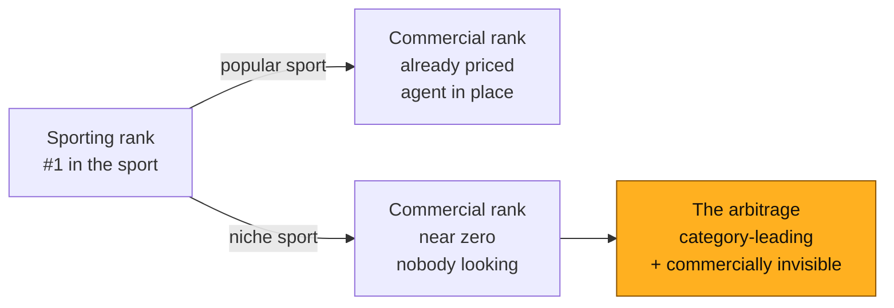
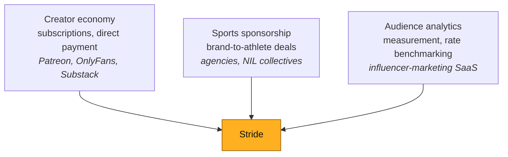
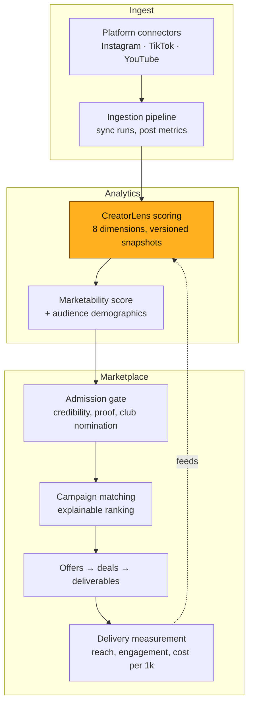
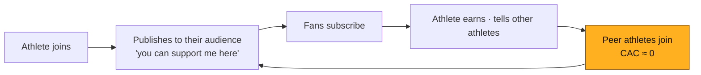

> [!abstract] How to read this
> This is a **preliminary draft** assembled for review, not a finished document.
> Every euro figure is generated from the financial model in this repository and
> re-checked by an automated guard, so the numbers are internally consistent —
> but the *assumptions behind them* are arguments, not facts, and Section 7 says
> which ones would hurt most if wrong.
>
> Where a figure is an estimate rather than a model output, it is marked
> **`[estimate]`**. Where research is still owed, it is marked **`[to research]`**.

---

# 1 · Executive Summary

**Stride is a creator platform with a sponsorship feature.**

Athletes are creators with a second payer. OnlyFans proved direct fan
monetisation beats ad-share; nobody has built it for athletes — who, unlike
lifestyle creators, also have sponsors, clubs, and a competitive record that
makes their audience *measurable*. Fan revenue leads and funds the early years.
Sponsorship compounds behind it.

### The thing most people get wrong

You do not start with famous athletes. You start where **sporting rank and
commercial value have come apart**.

| | Popular sports | Niche sports |
|---|---|---|
| Does an agent exist? | Yes, for the top. The tail is ignored | **No** |
| Athlete's alternative to us | An agent at 10–20%, if one will take them | **Nothing** |
| What we sell | Disintermediation | **Market creation** |
| Cost to acquire an athlete | €40 → €88 | **€16 → €36** |
| Who we compete with | Agencies who defend | **Nobody** |

### The numbers

| | Y3 | Y7 |
|---|---|---|
| Net revenue | €1.04M | €26.52M |
| EBITDA | €-274k | €9.99M |
| Active athletes | 5,500 | 52,000 |
| Paying fans | 46,333 | 759,408 |
| Gross margin | 69% | 73% |

EBITDA turns positive in **Y4**. Total capital to fund the plan: **€625k**
(peak burn €446k plus a 40% buffer). Take rates are published and fixed: **15%
on fan revenue, 10% on sponsorship**, no monthly athlete fee.

### The ask

**€400k pre-seed at €2.5M pre-money**, gated on evidence rather than milestones:
400 athletes · €10k MRR · anchor athlete public · payments processing real money
· **fan churn measured for three months.**

### What we would rather tell you than have you find

The plan rests on one assumption: that niche-sport fans churn **45% slower** than
the Patreon benchmark. Nothing in the product proves it, and the financial model
*understates* the risk by construction — it treats fan counts as targets and does
not charge for fan acquisition. See [[#7 · Risk Register]], risk **R1**.

---

# 2 · The Problem

## 2.1 The athlete

Consider a real profile — the kind we designed the product around.

> [!example] María, 27, trail runner
> Third at the national championship. 24,000 Instagram followers, 78% of them in
> Spain, most of them people who *also run*. She has:
> - no agent — none will take her, the commissions are too small
> - four unanswered brand DMs from the last six months
> - no idea what a post is worth, and no way to find out
> - a full-time job, because trail running does not pay
>
> Her audience is small, dense, and commercially excellent. Nobody has told her
> that, and no one is going to.

## 2.2 The three failures

**1 · Discovery fails.** A running-shoe brand wanting fifty authentic trail
athletes has no way to find them. There is no database, no rate benchmark, no
agency covering the segment. The brand defaults to one famous athlete at ten
times the price and a fraction of the relevance.

**2 · Pricing fails.** María cannot price herself because there is no public
comparable. Brands exploit this — not maliciously, they simply have no reference
either. Deals get made at whatever number is said first.

**3 · Monetisation fails entirely.** Even with a devoted audience, there is no
path from *audience* to *income* unless a brand happens to appear. Her followers
would pay for her training plans. There is nowhere for them to do it.

## 2.3 The reframe — the rank arbitrage

This is the insight the whole plan turns on, and it is worth stating precisely.

> [!important] Sporting rank and commercial value are coupled in popular sports and decoupled in niche ones
> In football, the market has already priced every point on the curve. A
> mid-table player has an agent, a club commercial department, and image rights
> that may not even be his to sell. There is no gap to arbitrage.
>
> In trail running, you can sign **the best athlete in the country** — and she is
> not "a top athlete" by any commercial definition, because the sport is small.
> She is simultaneously *category-leading* and *commercially invisible*.
>
> **That gap is the business.**

Why the gap is worth money rather than just being a sad fact:

- **Brands do not buy fame. They buy audience × relevance × price.** A national
  champion in trail running is more relevant to a running-shoe brand than a
  mid-table footballer with five times the following — and costs a fraction.
- **Niche audiences are practitioners, not spectators.** People who follow a
  trail runner *run*. They buy shoes, gels, packs, watches. A football fan
  watches football. Conversion differs by more than an order of magnitude.
- **Nobody is bidding.** No agency, no platform, no competitor. Acquisition cost
  is €16 in Y1 against €40 for a popular-sport athlete, and the difference is
  structural, not temporary.

## 2.4 Why now

**TEKTA launched 19 August 2026** — Publicis Sports, 3 Arts Sports, Travis Kelce.
A major agency has just validated that athlete monetisation is a category worth
building for. It also built the thing this thesis exists to remove: a
human-mediated consultancy, gated to *"a select group of Publicis Sports
clients"*, US college NIL, **no fan monetisation at all**.

They are the incumbent in our disintermediation pitch, not a competitor in our
marketplace one. Their economics *require* excluding the athlete we start with.

---

# 3 · Market

## 3.1 Industry overview

Three markets converge here, and Stride sits in the overlap.

**What each market proves for us:**

| Market | The proof it provides | The gap it leaves |
|---|---|---|
| Creator economy | Fans pay creators directly, at scale. Patreon: **10M paying members** across **286,287 creators** with ≥1 paying member | Nothing sport-specific. No sponsor side. No competitive record to price against |
| Sports sponsorship | Brands spend heavily on athlete association | Human-mediated, top-heavy, opaque pricing, ignores the long tail entirely |
| Influencer analytics | Audience can be measured and priced | Built for lifestyle creators; sport-specific signals (competition level, practitioner audience) are absent |

## 3.2 Macroeconomic context

> [!note] Directionally supportive, not load-bearing
> None of the plan's revenue depends on these holding. They are tailwinds, and
> we would rather name them as such than build on them.

- **Creator-economy spend keeps shifting from ad-share to direct payment.** The
  economics favour it: a direct subscription retains far more per euro than an
  ad impression. `[estimate]`
- **Brand budgets are moving from broadcast sponsorship to measurable,
  smaller-scale athlete partnerships** — the same shift influencer marketing went
  through a decade ago. `[to research: quantify with EU sponsorship spend data]`
- **Padel and trail running are in genuine structural growth in Europe**, not
  cyclical. Padel in Spain in particular. `[to research: federation licence
  counts, 2019→2026]`
- **Interest rates and a harder funding market** favour a plan that reaches
  EBITDA-positive in Y4 on €625k, rather than one that needs €10M to find out.

## 3.3 Market sizing

> [!warning] This is the weakest-evidenced section in the draft
> A rigorous TAM needs federation licence data we do not yet have. The funnel
> below is transparent about every step so each can be challenged and replaced.
> **The plan does not depend on the TAM** — it depends on the SOM, which is the
> model's own athlete targets, defended separately in §6.

**Bottom-up, EU-27 + UK:**

| Step | Figure | Basis |
|---|---|---|
| Population | ~520M | Eurostat |
| Regularly participate in organised sport | ~20% ≈ 104M | `[estimate]` |
| Compete at club level or above | ~8% of those ≈ 8.3M | `[estimate]` |
| **In niche sports** (excl. football/basketball majors) | ~55% ≈ 4.6M | Sport index segmentation |
| With ≥5,000 social following — i.e. a monetisable audience | ~3% ≈ **138,000** | `[estimate]` — the softest number here |
| **TAM** — annual revenue if all monetised at model ARPA | **≈ €70M** `[estimate]` | 138k × ~€510 blended net revenue per athlete at maturity |

**SAM — the reachable subset by Y7:** Spain, Portugal, France, Italy, Nordics,
UK. Roughly **40% of the above ≈ 55,000 athletes ≈ €28M**.

**SOM — what the plan actually claims:** **52,000 athletes and €26.5M of net
revenue by Y7.** That is close to the whole SAM, which is the honest tension in
this section and the reason it needs real data. Two readings:

1. The SAM estimate is too conservative — the ≥5k-followers filter at 3% is a
   guess, and the true figure is likely higher.
2. The Y7 athlete target is ambitious and should be stress-tested against
   federation data before it appears in front of an investor.

**Both are probably true.** `[to research]` is the honest label on this whole
subsection, and it is the highest-value research task in the plan.

## 3.4 Where we start — the sport index

We built a **714-pair opportunity index** (34 countries × 21 sports) scoring
supply, fandom, monetisability, sponsor demand and agent density.

**Top opportunities, all niche, all practitioner-audience:**

| # | Sport | Country | Score |
|---|---|---|---|
| 1 | running / trail | Finland | 80.6 |
| 2 | running / trail | Sweden | 80.5 |
| 3 | running / trail | Denmark | 80.0 |
| 4 | running / trail | Australia | 78.9 |
| **5** | **padel** | **Spain** | **78.2** |
| 6 | running / trail | United Kingdom | 77.7 |

**Spain, ranked:**

| Sport | Score | Segment | Audience |
|---|---|---|---|
| **padel** | **78.2** | niche | practitioner |
| **running / trail** | **74.9** | niche | practitioner |
| fitness / gym | 71.1 | niche | practitioner |
| cycling | 66.3 | niche | practitioner |
| athletics | 53.1 | popular | mixed |
| football | 53.1 | popular | spectator |

> [!tip] The launch decision writes itself
> We are a **Spanish company**. Spain's two best-scoring sports are **padel**
> and **trail running**, both niche, both practitioner-audience, both in growth.
> We start at home, in the two sports where the index says we should — and the
> index is a repeatable method, not a hunch, so the second market is chosen the
> same way.

**There is no single launch sport.** The index is context, not a gate. Athletes
are judged on audience, consistency, professionalism and willingness to publish;
sport is one input.

## 3.5 Competitive landscape

| | What they are | Fan monetisation | Long tail | Our relationship to them |
|---|---|---|---|---|
| **TEKTA** (Publicis/Kelce) | Agency consultancy, human-mediated | None | Excluded by design | The incumbent we disintermediate |
| **Traditional agents** | 10–20% for introductions | None | Won't take them | Same |
| **Patreon / Substack** | Creator subscriptions | Yes | Yes | Proof the demand exists; no sport context, no sponsor side |
| **Passes / Fanfix** | Creator platforms, some athletes | Yes | Partly | Closest analogue. Monthly creator fee — the pricing mistake we price against |
| **Influencer SaaS** (Aspire, Grin) | Brand-side discovery tools | No | Weak in sport | Sponsor-side only; no athlete relationship |
| **NIL collectives** (US) | College-athlete payment vehicles | No | US-only, regulatory | Different market, different legal frame |

**Nobody occupies our square:** self-serve, long-tail, EU, fan revenue *and*
sponsorship, priced transparently.

### Our defensibility, honestly assessed

| Moat | Strength | Why |
|---|---|---|
| Measured athlete data | **Strong, compounding** | Every synced account deepens the pricing benchmark nobody else has |
| Two-sided liquidity | **Strong once dense** | Sponsors come for supply; athletes come for demand |
| Brand with communities | **Medium** | Real but slow, and losable |
| Technology | **Weak alone** | Reproducible in months by a funded team |
| Take-rate pricing | **Weak alone** | Trivially copied |

The defensibility is the **data and the liquidity**, not the code. Which is why
the plan spends on athlete acquisition rather than on engineering headcount.

---

# 4 · Technology

## 4.1 What exists today

A working product, not a prototype — end to end, in CI, on two databases.

**Three design decisions worth a diligence call:**

1. **Every match score decomposes.** Eight components, each weighted, arithmetic
   visible — `audience fit 72 × 32% = 23.1`. No black-box ranking.
2. **Missing data is `null`, never `0`.** An unmeasured campaign reads as
   unmeasured, not free. A dimension we could not measure is *excluded from the
   score*, not counted as zero.
3. **Nothing self-verifies.** A club above the verification threshold still waits
   for a human to open its roster page. A rejected proof cannot be cleared by
   re-submitting the form.

## 4.2 What must still be built

| Phase | Ships | Unlocks | Gate |
|---|---|---|---|
| **P0** | Stripe Connect, athlete KYC | Money can move | — |
| **P1** | Tiers, subscriptions, entitlements, text/photo posts | **Fan revenue** | **Pre-seed** |
| **P2** | Video upload, transcode, paywalled delivery, moderation, age gate | Video tier | Pre-seed → Seed |
| **P3** | Deal payments, escrow, sponsor billing | Sponsorship revenue at scale | Seed |
| **P4** | DAC7, refunds/disputes, multi-currency | EU operations | Series A |

> [!important] P1 is the whole ballgame
> It is the cheapest possible test of the only assumption the business cannot
> survive being wrong about: **will fans of a semi-professional athlete pay
> €9.99 a month?** Text and photo behind a paywall answer that — no transcoding,
> no CDN decision, far less moderation exposure than video.

## 4.3 Infrastructure and the cost that decides viability

Content delivery is the cost that kills naive versions of this business.

| | Egress per GB | Total Y7 infrastructure |
|---|---|---|
| Naive (CloudFront list price) | €0.075 | €1.52M |
| **Zero-egress CDN architecture** | **€0.008** | **€419k** |

At **1.8 GB per fan per month**, the egress *rate* differs by **9.4×**. Total
infrastructure differs by **3.6×** — compute and storage are unaffected — which
is **€1.1M a year at Y7** and **€7.8M cumulative across the plan**.

In margin terms it is **4.1 points of gross margin at Y7** (72.8% → 68.6%). Not
existential, and we would rather size it correctly than call it existential: it
is a design-time architecture decision worth roughly one engineer-decade of
salary, taken once, at the start.

**Infrastructure trajectory:**

| | Y1 | Y3 | Y5 | Y7 |
|---|---|---|---|---|
| Infrastructure | €3k | €33k | €181k | €419k |
| Payment processing | €8k | €245k | €1.94M | €6.04M |
| Moderation | €1k | €17k | €79k | €165k |
| Athlete verification | €1k | €9k | €30k | €43k |

**Payment processing is the dominant COGS line — larger than infrastructure by
14× at Y7.** No amount of engineering removes it; it is why gross margin lands
in the low 70s rather than a SaaS 80%+, and pretending otherwise would be the
easiest way to lose credibility with anyone who has run a marketplace.

## 4.4 Team and scaling

| | Y1 | Y2 | Y3 | Y4 | Y5 | Y7 |
|---|---|---|---|---|---|---|
| Headcount (FTE) | 1.5 | 3.0 | 7.0 | 14.0 | 24.0 | 50.0 |
| People cost | €57k | €156k | €420k | €896k | €1.58M | €3.50M |

**Hiring sequence, and the reasoning:**

| Stage | Hires | Why then |
|---|---|---|
| Pre-seed (Y1–Y2) | 1 full-stack, 1 community/athlete lead, 0.5 ops | The product exists. The bottleneck is athletes, not features |
| Seed (Y3) | +2 engineering, +1 sponsor sales, +1 ops/review | Two-sided liquidity needs a demand side |
| Y4–Y5 | Engineering to 8, sales to 4, ops to 6, data to 2 | Second market, moderation load, learned ranking |
| Y6+ | Managed services, agency channel, EU compliance | Category leadership |

> [!note] The review queue is the hidden operational cost
> Manual proof review runs at ~4 minutes each and **250 reviews per 1,000
> applicants**. At Y7 volumes that peaks at roughly **0.6 of one FTE** — small,
> but the *latency* matters more than the cost: an athlete in the queue is not
> listed, not matchable, and not earning. Automated proof-checking already ships
> for the unambiguous cases; everything else stays with a human, deliberately.

---

# 5 · Go-to-Market, Marketing & Partnerships

> [!important] The strategic premise
> Niche sports are not small versions of big sports. They are **communities** —
> dense, physically co-located, highly sceptical of marketing, and connected by
> clubs, races and federations rather than by broadcast. You cannot buy your way
> in. You have to show up where they already are.

## 5.1 What we will not do, and why

| Not doing | Why |
|---|---|
| Paid social to acquire athletes | Highest-cost, lowest-trust channel in a community that detects marketing instantly. Signals desperation |
| Influencer marketing about influencer marketing | Corrosive to the credibility the whole product depends on |
| Chasing a famous athlete as a launch stunt | Proves fame monetises — which nobody doubted, and which **does not generalise downward** to the long tail the model is built on |
| Broad multi-sport launch | Community trust is per-community. Depth beats breadth until the loop is proven once |

## 5.2 The five channels

### 1 · The rate card as content — our single best marketing asset

Nobody in these sports knows what they are worth. **We do.**

Publishing *"What is a trail runner with 20,000 followers actually worth?"* —
with real, anonymised, measured benchmark data — is the most shareable artifact
that exists in these communities, because it answers the question every athlete
in them has privately wondered and none can answer.

- It gets forwarded in every club WhatsApp group without us asking.
- It is **marketing that is literally the product** — the measurement engine,
  shown working.
- It is defensible: we have the data, and competitors do not.
- It compounds: every athlete who joins makes the next benchmark better.

> [!tip] Content calendar built from the index
> The 714-pair index is a content engine. *"The ten best countries in Europe to
> be a professional climber, commercially"* · *"Padel's commercial gap: Spain
> vs Sweden"* · *"Why your sport pays less than the one next to it."* Each post
> is a genuine finding from real data, and each ends at a product that proves it.

### 2 · Race-day and tournament presence — where 100% of them are

Niche sports congregate **physically**, at predictable times, in one place.

- A trail race expo is 2,000 people of whom ~100% are practitioners and perhaps
  50 have a monetisable audience.
- A padel tournament weekend is the same shape.
- **Cost per qualified athlete conversation is lower than any digital channel**,
  and the conversation is face to face, which in a sceptical community is worth
  more than ten impressions.

`[to research: expo costs for 3–5 target Spanish events, 2027 calendar]`

### 3 · Club-down, not athlete-up

**One conversation with a club is 20–40 athletes.** The club channel is already
built into the product: verified clubs can nominate athletes, which raises the
athlete's credibility floor without letting the club bypass the gate.

- Clubs want their athletes earning — it retains them and makes the club
  attractive to join.
- Clubs have packages of their own to sell (already in the product).
- The nomination budget is bounded by the roster size the club declares, which
  makes inflating it a checkable claim rather than free headroom.

### 4 · Federations — the highest-leverage partnership

Niche-sport federations are **poor, under-resourced, and want their athletes to
earn**. They also have the complete list of licensed athletes in the country —
the exact dataset our market sizing lacks.

**The offer:** free analytics tooling for the federation and its athletes, in
exchange for introduction to the roster and co-marketing.

**Why they say yes:** it costs them nothing, it looks like they are doing
something for athletes who otherwise get nothing, and it makes their sport more
attractive to sponsors — which is their own mandate.

**Targets:** Federación Española de Pádel, Real Federación Española de
Atletismo (trail/mountain), regional Catalan federations.
`[to research: named contacts, existing commercial programmes]`

### 5 · The athlete as the channel

**Every athlete who joins markets to their own audience for free.** This is the
only channel that compounds without spend:

This loop is why **niche CAC is €16 against €40 for popular sports** — and why
it *falls* relative to revenue as density grows within a sport. Referral is the
default motion in a community where everyone races against each other monthly.

## 5.3 The anchor athlete — the single most important hire that is not a hire

The Y1 plan needs **one** athlete who is:

- **category-leading** in their sport (national-level or better),
- **audience-rich relative to their sport** (20k+, engaged, practitioners),
- **publicly willing** to say what they earn,
- and **articulate** about why it matters.

They are not an endorsement. They are the **proof**, and they will be quoted in
every subsequent conversation with an athlete, a federation and an investor.

> [!warning] This is a gating dependency, not a marketing task
> The pre-seed gate requires *"anchor athlete public"* for a reason: without one,
> there is no fan-churn data, and without churn data the plan's central
> assumption stays untested. Identifying and signing this person is the
> highest-priority action in the plan. `[to research: 5–10 named candidates in
> Spanish padel and trail]`

## 5.4 Sponsor-side acquisition

Sponsors are the **second** side and deliberately later — but not absent.

| Phase | Motion |
|---|---|
| Y1–Y2 | Founder-led, 10–20 regional brands. Free while supply densifies |
| Y3 | Self-serve + inbound from the content engine. First paid SaaS tiers |
| Y4+ | Sales org, agencies as *customers* rather than competitors |

**The pitch, once niche proof exists:** *"Here is what athletes in our network
earn from fans. Here is what your agency charges for introductions we make on
measured evidence."* That argument is quantified, and it needs the niche cohort
to exist first.

## 5.5 Brand and positioning

**Position:** the platform that tells athletes the truth about what they are
worth.

**Tone:** measured, unhyped, specific. The product refuses to show a zero where
it means "unknown" — the marketing should have the same discipline. In a
community that distrusts marketing, *accuracy is the differentiator*.

**What we never say:** "the next big thing in sports", any variant of "empowering
athletes", or any number we cannot show the derivation of.

---

# 6 · Financials

## 6.1 Revenue streams

| # | Stream | Take | Live? |
|---|---|---|---|
| 1 | Fan subscriptions | **15%** | P1 |
| 2 | Pay-per-view / unlocks | 15% | P2 |
| 3 | Tips | 15% | P1 |
| 4 | Sponsorship deals | **10%** | Built, P3 for payments |
| 5 | Club packages | 10% | Built |
| 6 | Sponsor SaaS | subscription | Built |

**Pricing decisions, fixed and published:** 15% fan / 10% sponsorship, **no
monthly athlete fee**. Tier prices €4.99 / €9.99 / €24.99 with an €89 season
pass; assumed mix 40/50/10.

## 6.2 The seven-year shape

| | Y1 | Y2 | Y3 | Y4 | Y5 | Y6 | Y7 |
|---|---|---|---|---|---|---|---|
| Net revenue | €0.03M | €0.23M | €1.04M | €3.37M | €8.40M | €16.20M | €26.52M |
| EBITDA | €-0.09M | €-0.19M | €-0.27M | €0.08M | €1.72M | €5.13M | €9.99M |
| Athletes | 400 | 1,800 | 5,500 | 13,000 | 25,000 | 38,000 | 52,000 |
| Paying fans | 2,058 | 12,217 | 46,333 | 130,165 | 285,069 | 490,646 | 759,408 |
| Deals | 25 | 176 | 889 | 3,356 | 8,970 | 17,518 | 27,331 |

**Y1 revenue is 87% fan subscriptions.** This is the point most easily
misunderstood: the demo shows the *sponsorship* engine, because that is what is
built — but the model's early years are a subscription business. Both are true
and the sequencing is deliberate.

## 6.3 Unit economics

| | Niche | Popular |
|---|---|---|
| CAC (Y1 → Y10) | **€16 → €36** | €40 → €88 |
| Monetising rate | 28% → 50% | 14% → 32% |
| Athlete churn/yr | 30% → 16% | 35% → 20% |
| Fans per monetising athlete (mature) | 37 | 48 |
| Fan ARPU/month (mature) | €9.49 | €8.26 |

Niche share of athletes falls **95% → 41%** across the plan — niche-first, then
popular sports enter from a position of proof.

## 6.4 Capital

| Stage | Amount | Pre-money | Gate |
|---|---|---|---|
| Internal | €80k + time | — | Product exists ✓ |
| **Pre-seed** | **€400k** | **€2.5M** | 400 athletes · €10k MRR · anchor athlete public · payments live · **3 months fan churn** |
| Seed | €2.0M | €10M | €80k MRR · churn <8%/mo · CAC payback <9mo · 2nd market · 30+ sponsors |
| Series A | €8.0M | €40M | €300k MRR · NRR >110% · sponsorship >25% of revenue |

**The plan needs €625k** (peak burn €446k + 40% buffer). The staged rounds raise
€2.4M before Series A. The difference is deliberate: raising only what the model
needs leaves no room for the assumption that turns out wrong, and a company that
runs out of cash in Y3 at the trough dies with a working product.

## 6.5 Valuation

**DCF: €22.8M enterprise value** (WACC 25%, terminal growth 3%). Terminal value
is **49%** of it — which is why we also show exit multiples, and why we would
rather you weight the comparables.

**Exit multiples at Y10** (revenue €57.96M): 4.0× revenue = €231.85M ·
6.5× = €376.75M · 9.0× = €521.65M · 14× EBITDA = €394.97M.

> [!note] Why the two disagree
> The DCF assumes growth collapses to 3% the day after Y10, from a year that
> still grew 22%. That is the standard failure of perpetuity-growth DCF applied
> to a company that has not finished growing — not an error in either method.

---

# 7 · Risk Register

Scored **probability × impact**, both 1–5. Ordered by product.

| # | Risk | P | I | Score | Mitigation |
|---|---|---|---|---|---|
| **R1** | **Fans do not pay for niche athletes** — the thesis fails | 3 | 5 | **15** | P1 is built specifically to test this for €80k, not €2.4M. Pre-seed gate requires 3 months of real churn data. If false, the sponsorship marketplace remains a smaller, viable business |
| **R2** | **Churn is at benchmark, not 45% better** | 3 | 4 | **12** | See below — the model understates this. Mitigation is measurement, early, on one athlete |
| **R3** | **Athlete acquisition is slower than modelled** | 3 | 4 | **12** | Club and federation channels are multiplicative (1 conversation = 20–40 athletes). Anchor-athlete referral loop. CAC has room: niche CAC is €16 against €40 popular |
| **R4** | **A funded competitor enters the niche** | 2 | 4 | **8** | Data and liquidity are the moat, not the code. 18–24 month head start on measured athlete data. Communities reward incumbency |
| **R5** | **Regulatory — DAC7, age assurance, Spanish startup law changes** | 2 | 4 | **8** | 18+ for fan subscriptions in v1, deliberately conservative. DAC7 is a P4 build. Legal budget €18k→€270k |
| **R6** | **Payment processing costs rise / Stripe terms change** | 2 | 4 | **8** | PSP is the dominant COGS line — €6.04M at Y7. Multi-PSP architecture from P0; take rate has headroom (15% vs 20% tested) |
| **R7** | **Moderation / content liability** | 2 | 3 | **6** | Text and photo only until P2. 18+ subscriptions. Moderation queue budgeted from Y1 |
| **R8** | **Key-person dependency on the anchor athlete** | 3 | 2 | **6** | Sign 3–5 rather than 1 as soon as capital allows. The proof is the *data*, which survives any individual leaving |
| **R9** | **Sponsor side never densifies** | 2 | 3 | **6** | Fan revenue leads by design; sponsorship is upside, not the base case. Y1 sponsorship is 9% of revenue |
| **R10** | **Infrastructure costs exceed model** | 1 | 3 | **3** | Zero-egress architecture is a 9× saving already designed in. Infra is 1.6% of Y7 revenue |

## R1 & R2 — the honest disclosure

> [!danger] The financial model understates our central risk, by construction
> The plan claims niche fans churn 45% slower than benchmark. Re-running the
> model at benchmark churn moves **Y10 revenue by +€0.07M** — it goes slightly
> *up*, and Y10 paying fans are **identical**.
>
> That is not reassurance. It is a **limitation of the model**: `fans_per_athlete`
> is a *target* the model solves backwards from, and marketing is driven by
> athlete adds rather than fan adds. So churn cannot change how many fans exist,
> and replacing them costs nothing.
>
> **What it really changes is the acquisition burden:** holding the same Y10 fan
> base needs **1.65M gross adds a year instead of 1.32M** — a quarter more
> acquisition, every year, forever, worth €0.86M of cumulative free cash flow.
>
> Treat the 45% as an operating assumption that decides *how hard the plan is to
> hold*, not as a revenue line item. A future version of the model should price
> fan acquisition so the sensitivity appears where it belongs.

**Why we are telling you this:** an investor who stress-tests the model finds it
in ten minutes. It is much better coming from us, and it is the difference
between a model that is decorative and one that is understood by the people
presenting it.

---

# 8 · Appendix

## 8.1 What still needs research

Ordered by how much the plan would change if the answer surprised us.

| # | Question | Why it matters | Effort |
|---|---|---|---|
| 1 | **Federation licence counts** — Spanish padel and trail, 2019→2026 | Replaces the softest number in §3.3 and validates or breaks the Y7 athlete target | 2 weeks |
| 2 | **Named anchor-athlete candidates** — 5–10 in Spanish padel/trail | Gating dependency for the pre-seed | 3 weeks |
| 3 | **Real tier-mix data** | 40/50/10 is assumed; it drives ARPU directly | Needs P1 live |
| 4 | **EU sponsorship spend, long-tail share** | Sizes the second engine | 2 weeks |
| 5 | **Federation commercial programmes** — what exists already | Partnership design, and whether we compete with them | 1 week |
| 6 | **Race/expo costs** for 3–5 Spanish events | Prices the highest-conviction acquisition channel | 1 week |

## 8.2 Method notes

- **Financial model:** `business-plan/model.py`. Ten-year projection, real
  working capital, capex, amortisation, loss carry-forward, Spanish Startup Law
  tax step (15% for four profitable years, then 25%).
- **Consistency:** an automated guard checks **43 prose claims across 9
  documents** against the model, plus the evidence chain from published
  comparables → derived assumptions. The build fails if any figure drifts —
  including this sentence, whose two numbers are themselves pinned to the
  guard's own contents.
- **Workbook:** `Stride_Financial_Model.xlsx`, 15 sheets, 1,973 formulas,
  verified for dangling references, unquoted sheet names, unbalanced brackets and
  dependency cycles.
- **Sport index:** `sport_index.py` — 714 country × sport pairs from a decomposed
  34-country × 21-sport matrix.

## 8.3 Sources

| Source | Used for |
|---|---|
| Patreon 2024 Transparency Report | Members per creator (34.9), churn band (10–15%), annual-plan multiplier (0.333), average support ($6.10) |
| Patreon / Backlinko 2026 | 10M active paying members, 286,287 creators with ≥1 paying member |
| Variety — OnlyFans FY2024 financials | GMV $7.22B, net revenue $1.41B, paid to creators $5.8B, revenue concentration |
| Creator-economy benchmarks | Typical patronage band $8–12/month |
| Publicis Sports / 3 Arts announcement, 19 Aug 2026 | TEKTA competitive read |
| Eurostat | Population base for sizing |
| Spanish Startup Law (Ley 28/2022) | Tax treatment |
| **Federation licence data** | **`[to research]` — see 8.1** |

## 8.4 Full document set

| # | Document | Settles |
|---|---|---|
| 00 | Executive summary | The two-page version |
| 01 | Revenue model | Eight streams, take rates, tier design |
| 02 | Cost model | AWS build-up, people, the two costs that decide viability |
| 03 | Financial model | Ten-year P&L, drivers, scenarios |
| 04 | Capital & valuation | Raise gates, Spanish instruments, DCF, exit multiples |
| 05 | Product gaps | What must be built before a euro moves; the age model |
| 06 | Market strategy | The two segments |
| 07 | Open questions | What is settled, what still needs a founder |
| 08 | Sport index | 714 pairs, method, three product uses |
| 09 | Analytics strategy | How the data function phases in |
| 10 | Competitor: TEKTA | What it validates, what its economics exclude |
| 11 | Admission & matching | The cold-start gate, club nomination, why no learned ranker yet |

---

> [!question] Open decisions for this draft
> 1. **Market sizing (§3.3)** — the SOM is close to the whole SAM. Federation data
>    resolves it. Which way do we expect it to move?
> 2. **Should the model price fan acquisition?** It would make R2 visible where it
>    belongs, and it would move EBITDA, FCF, capital need and valuation — i.e.
>    every number in the plan.
> 3. **Anchor athlete — do we have a route to one?** Everything in §5.3 depends on it.
> 4. **Do we lead the pitch with fan revenue or with the demo?** They tell different
>    stories about the same company, and the order changes the conversation.

*Preliminary draft v0.1 · figures generated from the model and guard-checked ·
prose is a draft for review.*
